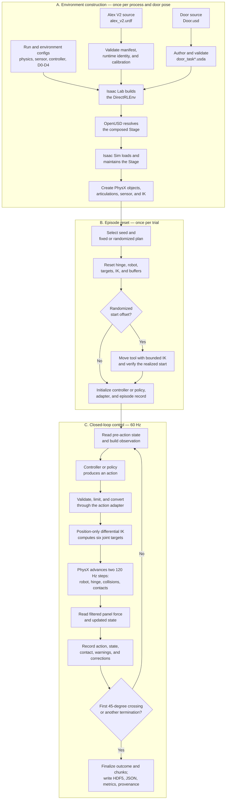

# Benchmark
## 1. What Is a Benchmark?
A benchmark is a **standardized experimental system** used to *measure and compare methods under clearly defined and repeatable conditions*. 
It specifies the problem to solve, the conditions in which it must be solved, the information and actions available to each method, and the evidence used to judge the result.

The **purpose of this standardization** is to make *results*:
- *comparable:* different methods are tested under equivalent conditions;
- *repeatable:* another researcher can execute the same experiment again;
- *interpretable:* a performance difference can be connected to a known experimental variable;
- *verifiable:* the result is supported by configurations, data, models, and recorded outputs rather than by a qualitative demonstration alone.

A task and a benchmark are therefore not the same thing. 
A **task** describes the desired behavior, such as pushing a door. 
A **benchmark** is the complete measurement system built around that task. It determines exactly what is tested, what is held constant, what is allowed to change, how many times the test is repeated, how performance is measured, and what records are required to reproduce the result.

### Main Types and Dimensions of Benchmarks
**There is no single universal classification.** The same benchmark can belong to *several categories at the same time* because each dimension answers a different question.

**Scope:** how much of the system the benchmark evaluates.
  - **Component microbenchmark:** isolates one component, operation, or subsystem.
  - **End-to-end benchmark:** evaluates the complete pipeline from input to task outcome.
  - **Task suite:** evaluates the same method across a collection of tasks.
**Interaction:** whether the evaluated method can affect what happens next.
  - **Offline dataset evaluation:** the method is tested on fixed recorded data and cannot change future observations.
  - **Online closed-loop evaluation:** every action changes the environment, the next observation depends on that change, and the policy acts again.
  - **Hybrid offline-to-online evaluation:** training or initial evaluation uses recorded data, followed by closed-loop execution in an environment.
**Environment:** where the experiment is executed.
  - **Simulation:** the robot and world are represented by software.
  - **Real hardware:** the experiment is performed with a physical robot.
  - **Sim-to-real:** a method developed in simulation is also evaluated on the physical system.
**Task coverage:** how many distinct tasks are included.
  - **Single-task:** all experiments address one defined task.
  - **Multi-task:** the same method is tested on several different tasks.
**Robot coverage:** how many robot embodiments are included.
  - **Single embodiment:** every experiment uses one robot design.
  - **Multi-robot:** multiple robots are evaluated, without necessarily requiring one shared representation or policy.
  - **Cross-embodiment:** knowledge, policies, or representations are explicitly compared or transferred across different robot bodies.
**Information:** which observations or instructions are available to the method.
  - **State-based:** the method receives structured quantities such as joint positions, poses, velocities, or forces.
  - **Vision-based:** the method receives camera images or video.
  - **Language-conditioned:** natural-language instructions specify or modify the desired behavior.
  - **Multimodal:** two or more information sources, such as state, vision, language, or audio, are combined.
**Objective:** which aspect of performance the benchmark is designed to measure.
  - **Success:** whether the task is completed.
  - **Efficiency:** how much time, energy, data, or computation is required.
  - **Robustness:** whether performance remains stable under noise or controlled disturbances.
  - **Generalization:** whether the method works in conditions that differ from those used for training.
  - **Safety:** whether execution respects force, collision, or other safety limits.
**Distribution:** how evaluation conditions relate to the training conditions.
  - **In-distribution:** evaluation conditions follow the same distribution as the training data.
  - **Controlled variations:** selected factors are changed systematically while the rest of the experiment remains controlled.
  - **Out-of-distribution:** evaluation introduces conditions outside the training distribution to test broader generalization.

### What a Complete Benchmark Includes
A *complete benchmark* includes at least:
1. **Task:** what must be done.
2. **Environment:** where the task takes place and what the method can observe and affect.
3. **Protocol:** initial conditions, duration, randomizations, repetitions, and execution rules.
4. **Metrics:** how performance is measured.
5. **Baselines:** reference methods used for comparison.
6. **Experimental control:** which variables remain fixed and which variables change.
7. **Provenance:** which data, configurations, models, software versions, and artifacts produced the result.

A concrete and well-known example is the [Arcade Learning Environment (ALE)](https://ale.farama.org/), commonly known as the Atari benchmark. 
It is used to compare agents that play Atari 2600 games. The same seven elements can be identified clearly:
1. **Task:** in each game, the agent observes the game state and selects joystick or fire actions to maximize the game score.
2. **Environment:** ALE provides the Atari 2600 emulator, the game ROMs, and a standard interface through which every agent observes and acts.
3. **Protocol:** the evaluation specifies elements such as the games, observation format, frame skip, sticky-action probability, episode termination, training budget, and evaluation procedure.
4. **Metrics:** agents are compared using episode scores for each game and aggregate normalized scores across the selected games.
5. **Baselines:** reference results such as random play, human play, and published agents show whether a new method performs poorly, reasonably, or better than established approaches.
6. **Experimental control:** competing agents use the same games, emulator settings, preprocessing, budgets, and evaluation rules. The learning method is the variable that changes.
7. **Provenance:** a reproducible result records the ALE and environment versions, game configuration, agent code and checkpoint, preprocessing and wrapper settings, and random seeds.

The distinction is important: playing *Breakout* is a task, whereas ALE, together with its protocol, metrics, controls, and reference results, forms the benchmark.

**Likewise, saying "the robot opened the door" is not enough.** 
We must know which door, which robot, which initial configuration, which policy, which success threshold, how many trials, which forces were measured, and which failures occurred.

## 2. Our Benchmark: AlexDoor-XAS
AlexDoor-XAS studies action representations for humanoid articulated-object manipulation. 
The current door-pushing benchmark is the **first concrete benchmark in that broader research project**, not the final limit of the project.

In this first benchmark, a simplified **fixed-base IHMC Alex V2 torso pushes a simulated hinged door**. 
*The robot, door, task, data, and evaluation conditions are kept as consistent as possible, while the main experimental variable is the language in which the policy describes the action to execute.*

The benchmark is therefore **not designed merely to prove that Alex can push a door once**. It is designed to compare whether different action representations produce different closed-loop behavior under matched conditions, including differences in task completion, efficiency, contact behavior, force, adapter corrections, failures, and robustness.

The long-term research objective is to determine whether representations that are less tied to one robot can provide a better foundation for generalization, cross-embodiment learning, and future vision-language-action policies. **The current benchmark creates a controlled first test of that idea**; it does *not yet demonstrate broad transfer or real-robot generalization.*

The table below classifies AlexDoor-XAS along the dimensions introduced above.

| Dimension | AlexDoor-XAS today |
|---|---|
| Scope | End-to-end benchmark on one task; it is not currently a task suite |
| Interaction | Offline training from recorded datasets followed by online closed-loop evaluation |
| Environment | Simulation only, using Isaac Sim and Isaac Lab |
| Task coverage | Single-task: door pushing |
| Robot coverage | Single embodiment: the fixed-base Alex V2 torso |
| Information | State-based |
| Objective | Controlled comparison of action representations, including task-success, force, and safety measurements |
| Distribution | Small controlled D0-D4 variations, not broad out-of-distribution generalization |

In one sentence:
> AlexDoor-XAS is currently a simulated, single-task, single-embodiment, state-only, closed-loop benchmark
> for comparing action representations under matched conditions.

The following table maps the seven components of a complete benchmark to the current AlexDoor-XAS implementation:

| Benchmark component  | AlexDoor-XAS today                                                                                                                                                              |
| -------------------- | ------------------------------------------------------------------------------------------------------------------------------------------------------------------------------- |
| Task                 | Use Alex's right-hand contact point to push the hinged door panel to 45 degrees under the D0-D4 task variations                                                                 |
| Environment          | State-based closed-loop simulation in Isaac Sim and Isaac Lab, using a fixed-base Alex V2 asset, one articulated door, contact sensing, and a supporting floor                  |
| Protocol             | Versioned configurations define initial conditions, pose and seed schedules, simulator timing, episode limits, and first-crossing termination                                   |
| Metrics              | Task completion is considered together with door motion, timing, contact, force, adapter behavior, warnings, and failures                                                       |
| Baselines            | A scripted reference controller provides demonstrations, while state-only ACT and Diffusion policies provide learned comparison methods where defined                           |
| Experimental control | Compared methods use matched robot, task, data, poses, seeds, controller contracts, safety limits, and evaluation conditions; the action representation is the primary variable |
| Provenance           | Calibrations, datasets, splits, configurations, checkpoints, evaluations, and retained artifacts are versioned or fingerprint-bound                                             |

### Task
The task defines the **physical behavior** that every compared method must **produce**. 
It is intentionally narrower than "understand a door and open it in any possible way":

> Starting from a valid initial state, **Alex's right-hand contact point must approach the door panel, establish contact, and push it until the revolute hinge reaches 45° (`pi/4`)**.

This is a **door-pushing task**, not a complete door-opening task. 
*The robot does not identify or operate a handle, form a grasp, pull the panel, decide which side to use, or choose among multiple opening strategies.* 
Those capabilities would introduce additional perception, planning, and manipulation problems that are outside the controlled question of this first benchmark.

The task is **complete** at the first **crossing** of the **45-degree hinge-angle threshold.** 
This gives every method the *same unambiguous physical objective*: produce enough controlled contact motion to rotate the same articulated object through the same angle.

### Environment
The **environment** is the complete interactive system through which the evaluated method observes the task, produces actions, and experiences their consequences.
Thus, at every control step, the environment provides an observation, receives an action, applies it to the simulated world, advances the physics, and returns the resulting state.
 It includes the scene and its assets, but also the physical dynamics, sensors, observation interface, action interface, simulation timing, and the mechanisms used to reset, advance, and terminate an episode.

A **scene** describes what exists in the simulated world and how it is arranged. 
An **environment** additionally defines how that world evolves over time and how a controller or policy can interact with it.

The responsibility boundary is easiest to understand as one chain:
- **Our project code decides the experiment.** It specifies the assets, observations, action meanings, controllers, reset rules, termination conditions, timing, and measurements required by AlexDoor-XAS.
- **Isaac Lab organizes that experiment as an environment.** It translates the project configuration into uniform objects and lifecycle operations that Isaac Sim can use, and it calls Isaac Sim functions to create, connect, control, reset, and observe the concrete elements in the Stage.
- **Isaac Sim executes the requested simulation.** It loads and maintains the Stage, coordinates the simulation runtime, sensors, rendering, and selected physics backend, and advances simulated time when Isaac Lab requests a step.
  - **PhysX receives low-level physical commands and calculates physical evolution.** It integrates rigid-body and articulation dynamics, enforces joints and constraints, detects and resolves collisions, and computes contact forces; it does not understand policies, task success, or episodes.
  - **OpenUSD represents and composes the assets and scene.** It describes what exists, how it is organized, and which physical schemas are authored; it does not calculate motion.

These layers expose some overlapping capabilities because Isaac Lab is built on Isaac Sim and calls its APIs. Their responsibilities are nevertheless distinct: project code decides, Isaac Lab structures and schedules, Isaac Sim executes and coordinates, OpenUSD represents, and PhysX physically evolves the world.

AlexDoor-XAS currently evaluates policies entirely in simulation; the physical Alex003 platform is the reference robot and future transfer target, but it is not part of the present benchmark evidence.

#### Isaac Lab
**Definition.** Isaac Lab is a modular Python framework for robot learning built on top of Isaac Sim. It supplies the abstractions and lifecycle used to turn an Isaac Sim scene into a structured, repeatable environment that a controller, policy, data generator, or learning algorithm can interact with. The framework overview is in the [Isaac Lab documentation](https://isaac-sim.github.io/IsaacLab/main/index.html).

**What it does and why it exists.** Isaac Sim already provides the simulation runtime, but using it directly would require every project to recreate its own conventions for scene access, action processing, observations, resets, timing, vectorization, and episode state. Isaac Lab standardizes these concerns through reusable Python interfaces for:
- robots, rigid objects, articulations, and sensors;
- controllers and actuator interfaces;
- observations and actions;
- reset, event, and randomization logic;
- reward, termination, command, and curriculum logic where required;
- vectorized environments and batched buffers;
- Gymnasium-compatible environment lifecycles;
- reinforcement learning, imitation learning, motion planning, data generation, and closed-loop evaluation workflows.

Isaac Lab does not choose the scientific task or policy. Project code supplies the task-specific assets, action meanings, observations, limits, reset rules, and success conditions. Isaac Lab organizes those decisions and invokes Isaac Sim in a consistent order.

The following subsections cover the Isaac Lab components that participate in AlexDoor-XAS and the principal optional components that could become relevant later. A heading marked `(unused)` means that Isaac Lab provides the component, but the current benchmark does not configure or call it.

##### AppLauncher
`AppLauncher` is Isaac Lab's bootstrap wrapper for starting the Isaac Sim application. It processes launch options such as headless execution, device selection, camera enablement, and application experience; starts the Omniverse Kit application; loads the required extensions; and exposes the running application handle to the script.

It must run before code imports runtime-dependent `isaaclab`, `omni`, or `pxr` modules because those modules expect the Isaac Sim application and its plugins to exist. `AppLauncher` does not create the task, choose actions, or step physics. It prepares and later closes the application in which those operations can occur.

**AlexDoor-XAS:** every simulator entry point constructs `AppLauncher` before its runtime imports. This gives asset verification, calibration, generation, scripted evaluation, and learned-policy evaluation the same supported initialization boundary.

##### SimulationContext
`SimulationContext` is Isaac Lab's high-level interface to the active Isaac Sim simulation runtime. It applies `SimulationCfg`, creates or accesses the physics scene, establishes the physics timestep and compute device, controls reset and play initialization, requests simulation steps, and decides when rendering is updated.

It coordinates one simulator instance; it does not define episodes, observations, rewards, success, or the scientific protocol. In a `DirectRLEnv`, the environment base class owns the context and calls it according to decimation. Standalone verification and calibration scripts can construct it directly when they need a simulation loop without a complete task environment.

**AlexDoor-XAS:** `SimulationCfg` specifies `dt = 1/120 s`, CPU physics by default, and a render interval equal to the control decimation. The environment base requests two physics steps for each `60 Hz` control tick.

##### Task Design Workflows
A **task design workflow** is the software architecture used to implement an environment. It does not select the robot, physics backend, training algorithm, or task objective. The same physical task can be implemented with either workflow and, if both implementations issue the same commands from the same states, PhysX can produce the same physical result.

There are two related but different decisions:
- **Decision A — code organization style:** Manager-based or Direct;
- **Decision B — environment interface type:** the concrete base class and interaction contract exposed to the caller.
These are related dimensions, but they are not a complete two-by-two matrix: Isaac Lab provides different concrete interface classes for the two styles.
###### Decision A — Code Organization Style
**Manager-based workflow (unused in AlexDoor-XAS).** In the Manager-based style, task responsibilities are decomposed into specialized managers. Project code primarily declares configuration objects and small task-specific functions or classes called **terms**. 

Isaac Lab's **environment class** constructs the managers and calls them in the required order.
A **manager** is not an autonomous agent. It is deterministic framework code responsible for one category of environment behavior. It owns categories of work.
A **term** is one configured unit of task-specific behavior handled by that manager. Each term computes one quantity, so it contains the individual task calculations. 
The [Manager-based environment tutorial](https://isaac-sim.github.io/IsaacLab/main/source/tutorials/03_envs/create_manager_rl_env.html) demonstrates this separation.

For example:
```text
ObservationManager
    ├── tool_position term
    ├── tool_orientation term
    ├── door_angle term
    └── door_frame_pose term
```

The principal managers are:

| Manager              | Responsibility                                                                                                                                                                                                                                                                                      |
| -------------------- | --------------------------------------------------------------------------------------------------------------------------------------------------------------------------------------------------------------------------------------------------------------------------------------------------- |
| `ActionManager`      | Processes raw policy actions, divides them among configured action terms, and converts them into low-level asset commands                                                                                                                                                                           |
| `ObservationManager` | Computes observation terms from scene state and sensors and assembles observation groups such as `policy` or `critic`. So it resolves the referenced scene entities, applies configured processing such as noise or history, groups or concatenates the results, and returns the final observation. |
| `EventManager`       | Applies operations at lifecycle modes such as startup, reset, or periodic intervals; common uses include reset and randomization                                                                                                                                                                    |
| `RecorderManager`    | Records configured data before and after environment steps and resets                                                                                                                                                                                                                               |
| `CommandManager`     | Generates task goals for goal-conditioned behavior, such as a desired velocity or target pose; a command is an objective given to a policy, not the action produced by that policy                                                                                                                  |
| `RewardManager`      | Computes reward terms and combines their weighted contributions                                                                                                                                                                                                                                     |
| `TerminationManager` | Computes task terminations and timeouts by combining configured Boolean termination terms                                                                                                                                                                                                           |
| `CurriculumManager`  | Changes configured task parameters or term settings as training progresses                                                                                                                                                                                                                          |
The scene is also central, but `InteractiveScene` is the shared container for assets and sensors rather than one of the task-term managers listed above.

The manager-based environment class is the coordinator. A typical `ManagerBasedRLEnv.step(action)` follows this lifecycle:
```text
raw action
    -> ActionManager processes the action
    -> for each decimated physics step:
           ActionManager applies asset commands
           scene data is written to Isaac Sim
           Isaac Sim and PhysX advance one physics step
           scene and sensor buffers are updated
    -> TerminationManager computes terminal and timeout flags
    -> RewardManager computes reward
    -> terminated environments are reset through managers and events
    -> CommandManager and interval events are updated
    -> ObservationManager constructs the next observation
    -> observation, reward, termination flags, and metadata are returned
```


**Direct workflow.** In the Direct style, project code implements the main task responsibilities directly in one environment subclass instead of using collections of manager terms. 
So direct means that the core task is not decomposed across the full manager system.

However a separate configuration class still declares simulation, scene, timing, space dimensions, or task parameters.
For a `DirectRLEnv`, project code normally implements hooks:

| Hook                         | General responsibility                                                             |
| ---------------------------- | ---------------------------------------------------------------------------------- |
| `_setup_scene()`             | Creates or registers assets, articulations, rigid objects, and sensors             |
| `_pre_physics_step(actions)` | Validates and preprocesses each new environment-level action                       |
| `_apply_action()`            | Writes the prepared low-level commands into simulated assets before a physics step |
| `_get_observations()`        | Reads state and sensor data and constructs observations                            |
| `_get_rewards()`             | Computes reward values required by the interface                                   |
| `_get_dones()`               | Computes terminal and timeout flags                                                |
| `_reset_idx(env_ids)`        | Restores selected environments, task state, buffers, and controller state          |
The Isaac Lab `DirectRLEnv` base class still owns `step()`, `reset()`, decimation, simulation calls, counters, batched buffers, auto-reset behavior, and the Gymnasium return contract. It calls the project hooks at the correct points. The base class may also reuse selected infrastructure such as `EventManager

The Direct lifecycle is:
```text
raw action
    -> project _pre_physics_step(action)
    -> for each decimated physics step:
           project _apply_action()
           scene data is written to Isaac Sim
           Isaac Sim and PhysX advance one physics step
           scene and sensor buffers are updated
    -> project _get_dones()
    -> project _get_rewards()
    -> project _reset_idx() for terminated environments
    -> project _get_observations()
    -> observation, reward, termination flags, and metadata are returned
```

**AlexDoor-XAS Direct implementation.** The shared robot environment class [`DoorPushRobotEnv`](../../../src/alexdoor_xas/envs/door_task/door_push_robot_env.py) implements the hooks directly:
- `_setup_scene()` spawns the task layer and creates the door and robot `Articulation` handles and gripper `ContactSensor`;
- `_pre_physics_step()` checks the action shape, applies per-tick clamps, and calls the position-only differential-IK path;
- `_apply_action()` writes six right-arm joint-position targets;
- `_get_observations()` reads the hinge state and tool-point pose;
- `_get_rewards()` returns zero because the current benchmark does not train an RL policy inside the environment;
- `_get_dones()` provides the environment timeout contract;
- `_reset_idx()` restores door and robot joint state, actuator targets, IK state, clamp telemetry, and other buffers.
Benchmark-specific success at the first `pi/4` hinge crossing and additional fail-closed rollout outcomes are handled by the project rollout/evaluation layer. 

**Practical difference.** Both workflows eventually write commands to the same Isaac Lab assets and request the same Isaac Sim physics steps. The difference is the organization of the code around those steps.

| Aspect | Manager-based | Direct |
|---|---|---|
| Main organization | Environment behavior divided among managers and terms | Core task behavior implemented in one environment subclass |
| Typical project code | Configuration classes plus reusable term functions/classes | Configuration class plus explicit lifecycle-hook methods |
| Control over coupled logic | Must be expressed through manager boundaries or custom terms | Direct access to task state and execution order inside the class |
| Reuse across task variants | High: terms and configurations can be swapped or inherited | Requires shared helper functions, subclasses, or explicit conditional logic |
| Traceability while debugging | Requires following configuration, manager, and term resolution | Main task flow is visible in one class and its helpers |
| Collaboration | Different contributors can own independent term families | Coordination is needed when several contributors edit the same environment class |
| Optimization | Managers provide standardized batched execution | Large coupled operations can be fused or optimized directly with PyTorch, JIT, or Warp |
| Main maintenance risk | Excessive fragmentation and configuration indirection | A monolithic environment class with duplicated or non-reusable logic |

**When to use Manager-based.** Prefer Manager-based when:
- *building a family or suite of related tasks;*
- *reusing* observations, actions, rewards, events, or terminations across robots or task variants;
- systematically *swapping* reward definitions, commands, randomizations, or curricula;
- *several contributors* need clean ownership boundaries;
- the task *decomposes* naturally into independent terms;
- standardized RL task construction is more valuable than complete local control.

**When to use Direct.** Prefer Direct when:
- *building one specialized environment with tightly coupled logic;*
- precise action processing, controller state, telemetry, or fail-closed checks must remain easy to trace;
- the control flow is difficult or artificial to split into independent terms;
- a short path to a custom environment is valuable;
- environment calculations require task-specific optimization;
- reuse through managers does not yet justify the added abstraction.

**Why AlexDoor-XAS uses Direct.** The current implementation shows why Direct is an appropriate fit today:
- the benchmark has one specialized door-pushing environment rather than a broad suite of manager-composed tasks;
- action clamping, position-only IK, six-joint target generation, calibrated tool geometry, joint-limit telemetry, and reset state are tightly coupled;
- exact panel-filtered contact evidence and fail-closed rollout semantics require explicit control and traceability;
- scripted, ACT, and Diffusion action sources all use the same direct execution path;
- training occurs offline, so the environment does not need a modular collection of RL reward terms or curricula;
- the code already shares common behavior through Python base classes and helpers rather than manager terms.

A Manager-based implementation would be possible and could become attractive if AlexDoor-XAS grows into a large task family with many interchangeable observations, action implementations, randomizations, rewards, and robots. It would reorganize the task code; it would not change the role of Isaac Sim, OpenUSD, or PhysX.

###### Decision B — Environment Interface Type
The second decision selects the concrete interaction contract exposed by the environment. 
It answers questions such as: Is this only a sense-act environment? Does it return rewards and termination flags? Is there one logical agent or more than one?

Isaac Lab currently exposes these four principal classes:

| Class | Code style | Interface and behavior | Use it when |
|---|---|---|---|
| `ManagerBasedEnv` (unused) | Manager-based | Base sense-act environment with scene, action, observation, event, and recorder managers; it does not define the MDP-specific reward, termination, command, or curriculum layer | Traditional control, teleoperation, motion planning, data collection, or another workflow that needs observations and actions without an RL episode contract |
| `ManagerBasedRLEnv` (unused) | Manager-based | Extends `ManagerBasedEnv` with Gymnasium-style rewards, terminal/timeout flags, automatic reset, commands, and curriculum through the corresponding managers | Single-agent RL-style tasks whose components should remain modular and configurable |
| `DirectRLEnv` | Direct | Gymnasium-style vectorized single-agent environment whose task-specific observations, actions, rewards, dones, and resets are implemented through direct hooks | A specialized single-agent environment requiring fine-grained control, whether used for RL, imitation learning, scripted control, data generation, or evaluation |
| `DirectMARLEnv` (unused) | Direct | Vectorized multi-agent environment with agent-specific observation, action, reward, and termination structures, designed around parallel multi-agent interaction | Multiple independent logical agents act in the same environment and require distinct interfaces or rewards |

The available classes are intentionally asymmetric:

| Required interface | Manager-based choice | Direct choice |
|---|---|---|
| Sense-act without an RL reward/done contract | `ManagerBasedEnv` | No separate core `DirectEnv` equivalent; use a suitable existing interface or a custom design if the RL-shaped contract is genuinely unwanted |
| Single-agent RL-shaped lifecycle | `ManagerBasedRLEnv` | `DirectRLEnv` |
| Multi-agent RL-shaped lifecycle | No principal `ManagerBasedMARLEnv` among these four classes | `DirectMARLEnv` |

The `RL` in a class name describes the **shape of the interface**, not a mandatory training algorithm. An RL-shaped environment normally provides:
```text
observation, reward, terminated, truncated, info = env.step(action)
```
That contract is also useful for scripted controllers, imitation-learning evaluation, dataset generation, and policy benchmarking. Reward may legitimately be zero if learning is performed elsewhere.

**When to choose each interface.** The selection rule is:
- choose `ManagerBasedEnv` when only structured sensing, acting, events, and recording are required;
- choose `ManagerBasedRLEnv` when a single-agent RL-shaped lifecycle and modular manager terms are both required;
- choose `DirectRLEnv` when a single-agent RL-shaped lifecycle is useful but task behavior should be implemented directly;
- choose `DirectMARLEnv` only when the simulated problem contains multiple logical agents with separate interfaces, not merely because one robot has several limbs or controllers.

**Why AlexDoor-XAS uses `DirectRLEnv`.** AlexDoor-XAS has one logical agent: the policy or scripted controller produces one action for Alex's controlled right arm. The door is an articulated object, not a second agent. `DirectMARLEnv` would therefore add the wrong abstraction. A base sense-act interface could run the controller, but the `DirectRLEnv` contract already provides the batched Gymnasium lifecycle, step counters, timeout/truncation semantics, reset handling, and standard return structure used by generation and evaluation code. At the same time, the Direct style keeps the custom IK, contact, limit, and reset logic explicit. The environment returns zero reward because ACT and Diffusion are trained offline; using `DirectRLEnv` does not imply that reinforcement learning occurs inside Isaac Sim.

##### InteractiveScene
`InteractiveScene` is Isaac Lab's central container for the entities that belong to one vectorized simulation scene. It reads an `InteractiveSceneCfg`, creates or registers assets and sensors, clones the configured environment instances, groups entities by type, stores their environment origins, and provides uniform `reset()`, `write_data_to_sim()`, and `update()` operations.

It does not decide which scene entities become observations or which actions control them. It makes those entities accessible to the environment, controllers, managers, and sensors. The observation-building code then selects only the required state.

**AlexDoor-XAS:** the scene registers the door and Alex as articulations, the proxy end effector as a rigid object in the proxy environment, and the gripper contact sensor in the articulated-robot environment. It also owns the single environment origin and the synchronization boundary between Isaac Lab buffers and the simulator.

##### Asset Wrappers
Isaac Lab asset wrappers provide uniform, batched Python interfaces over simulated scene entities. A configuration object says where and how an entity is spawned; the runtime wrapper exposes its state buffers and methods for writing commands or reset state.

The wrappers used by AlexDoor-XAS are:
- **`AssetBase`:** the general base for scene entities and non-interactive content; the task USD layer is spawned through an `AssetBaseCfg`;
- **`Articulation`:** represents a jointed mechanism and exposes its root, links, joints, limits, Jacobians, actuators, and command buffers; both Alex and the hinged door use it;
- **`RigidObject`:** represents a non-articulated rigid body and exposes its root pose, velocity, and physical command interface; the legacy proxy end-effector sphere uses it.

These wrappers do not replace USD or PhysX. USD identifies and describes the underlying prims, PhysX evolves them, and the Isaac Lab wrapper gives project code a consistent tensor-oriented interface to their runtime state.

##### Actuator Models
An actuator model converts an environment- or controller-level joint command into the position target, velocity target, or effort that is written to the simulated articulation. It also carries parameters such as stiffness, damping, effort limits, and velocity limits.

Isaac Lab distinguishes implicit actuators, whose drive behavior is primarily executed by the physics solver, from explicit actuator models that compute actuator effort in software before sending it to the simulator. Actuators do not choose the task action and do not solve IK; they execute the joint-level target selected upstream.

**AlexDoor-XAS:** Alex's controlled arm uses calibrated position-drive gains, while the door uses an `ImplicitActuatorCfg` with zero stiffness and nonzero damping to model passive hinge resistance. The environment sends six right-arm position targets; the actuator and PhysX drive machinery turn those targets into physical joint motion.

##### DifferentialIKController
`DifferentialIKController` is Isaac Lab's batched differential inverse-kinematics controller. Given a desired end-effector position or pose change, the current end-effector state, the relevant Jacobian, and current joint positions, it computes desired joint positions. Available inversion methods include pseudoinverse, SVD, Jacobian transpose, and damped least squares.

The controller performs a kinematic conversion; it does not move the robot, resolve collisions, enforce contact, or decide whether the task succeeds. The environment must provide frame-consistent inputs, select the controlled joints, clamp unsafe targets, and send the result to the articulation.

**AlexDoor-XAS:** the controller runs in relative, position-only mode with damped least squares. It converts each requested world-frame tool translation into targets for the six right-arm joints. The environment applies joint-limit clamping, and PhysX determines the resulting physical motion and contact.

##### Contact Sensor
A contact sensor is an interface over contacts already computed by the physics backend. It does not create a collision, enable a collider, or apply a force.

The causal order is:
```text
PhysX detects and resolves collider contact
        |
        v
PhysX exposes contact forces
        |
        v
Isaac Lab ContactSensor organizes the requested force data
        |
        v
Environment, policy, and recorder consume that data
```
The Isaac Lab `ContactSensor` is a `SensorBase` implementation that activates or relies on PhysX contact reporting, creates the appropriate rigid-contact tensor view, updates batched force buffers at its configured simulated-time period, and optionally separates forces involving selected contact partners. It is therefore an Isaac Lab component built over PhysX reporting, not an independent physics engine or an Isaac Sim peer of PhysX.

The sensor must be attached to the rigid body or bodies whose contact forces are being observed. Examples include feet against the floor, gripper fingers against an object, a mobile-robot bumper, or a manipulator link against a workpiece. The [Isaac Lab contact-sensor documentation](https://isaac-sim.github.io/IsaacLab/main/source/overview/core-concepts/sensors/contact_sensor.html) explains that the sensor scope and optional contact-partner filter are separate choices.

**AlexDoor-XAS:** `DoorPushAlexV2EnvCfg` places the sensor on the exact Alex right-gripper link:
- body: `RIGHT_GRIPPER_Z_LINK`;
- runtime prim: the nested gripper-link prim below `/World/envs/env_.*/Alex`;
- update period: `0.0`, meaning every simulation step;
- maximum retained contact records per prim: `16`.
The configuration lives in [`src/alexdoor_xas/envs/door_task/door_push_alex_v2_env_cfg.py`](../../../src/alexdoor_xas/envs/door_task/door_push_alex_v2_env_cfg.py).

**Filter.** The filter means: among all contacts involving the sensed gripper link, report the entries whose other shape is this panel collider. It does not move the sensor, turn collisions on or off, or prevent other collisions from physically occurring.

`filter_prim_paths_expr` identifies the contact partner whose force must be reported separately. This benchmark uses the exact door-panel collider:
```text
/World/envs/env_.*/DoorTaskScene/DoorTaskDoor/Door/Cylinder_001
```

Consequently:
- gripper against panel -> physical contact and admissible task-contact **evidence**;
- gripper against frame -> physical collision, but not panel-force evidence;
- arm against floor -> physical collision, but not panel-force evidence;
- robot self-collision -> physical collision, but not panel-force evidence.
`DoorPushAlexV2Executor.contact_force_w()` requires the filtered `force_matrix_w`, checks its shape and finiteness, and sums every exact-panel filter entry. It deliberately refuses to fall back to unfiltered net force. `contact_sensed()` declares contact when the norm of that filtered force reaches the calibrated `1.5 N` threshold.

##### Camera Sensor (unused)
Isaac Lab's camera sensor wraps rendered camera outputs into batched, periodically updated buffers. Depending on its configuration and renderer support, it can expose RGB, depth, normals, segmentation, optical flow, and related annotations for vision policies or dataset generation.

AlexDoor-XAS does not use an Isaac Lab camera sensor in its policy observation. Optional evaluation videos come from the rendered viewport or `rgb_array` output and do not change the state-based observation contract.

##### Frame Transformer (unused)
`FrameTransformer` reports the pose of one or more target frames relative to a configured source frame. It is useful when observations, controllers, or rewards repeatedly need relative transforms without each caller manually composing world-frame poses.

AlexDoor-XAS currently computes its required door-relative and tool-related transforms through project geometry and kinematics code, so it does not register a `FrameTransformer` sensor.

##### Inertial Measurement Unit (unused)
Isaac Lab's IMU sensor exposes simulated orientation, angular velocity, and linear acceleration or specific-force information for a selected rigid body. It is useful for locomotion, state estimation, disturbance detection, and sim-to-real sensor pipelines.

AlexDoor-XAS does not use IMU measurements because the benchmark observes the joint, tool, and door state required for manipulation directly.

##### Ray Caster (unused)
The ray-caster sensor traces configurable batches of rays against scene geometry and returns hit positions, distances, normals, or related data. It is commonly used for terrain height scans, proximity sensing, simplified range perception, and ray-based camera approximations.

AlexDoor-XAS does not use ray-cast observations; contact is determined through PhysX collision/contact reporting rather than proximity rays.

##### Visuo-Tactile Sensor (unused)
Isaac Lab's visuo-tactile sensor models an optical tactile device whose internal camera observes deformation or contact appearance at a tactile surface. It is useful when a policy must infer local contact geometry from tactile images rather than use simulator ground-truth forces directly.

AlexDoor-XAS currently uses the filtered PhysX contact force on the gripper link and has no optical tactile asset or tactile-image observation.

Isaac runs only on the workstation. Training and inference may use a GPU; Gilbreth training uses PyTorch on A100 GPUs but does not run Isaac.
#### Isaac Sim
Isaac Sim is NVIDIA's robotics-simulation platform. See the [Isaac Sim 6.0 documentation](https://docs.isaacsim.omniverse.nvidia.com/6.0.0/index.html).

It provides the application and runtime in which assets are imported, an OpenUSD stage is assembled and loaded, sensors and renderers are connected, and a selected physics backend is advanced. In general, Isaac Sim **can:**
- import robots and scenes from URDF, MJCF, Onshape CAD, or USD;
- assemble 3D worlds in a shared USD representation;
- configure rigid bodies, joints, collisions, materials, lights, cameras, and sensors;
- run the PhysX backend, or another supported backend where applicable;
- render cameras and other RTX outputs;
- generate synthetic data;
- connect to ROS 2 and robot software;
- execute and verify controllers before physical deployment.
The official workflow is `import -> configure -> simulate -> connect/deploy`.

**AlexDoor-XAS:** Isaac Sim 6.0.1 runs on the workstation. It loads the composed door-task stage, invokes the URDF import path for Alex, advances simulation time, exposes the resulting USD/physics state, and can render evaluation videos. The benchmark's official physics execution is configured on the CPU.

The following subsections cover the principal Isaac Sim and Omniverse components that can participate in this workflow. `(unused)` means that the capability is available in the installed platform but is not part of the current AlexDoor-XAS benchmark path.

##### Omniverse Kit
Omniverse Kit is the application framework that hosts Isaac Sim. It provides the plugin and extension system, application event loop, settings, commands, UI and headless modes, USD context, timeline events, and the lifecycle through which physics, rendering, sensors, importers, and integrations are started and coordinated.

Kit is not the scene format and not the physics engine. It is the host application that keeps those systems running together. Isaac Lab's `AppLauncher` selects and starts the appropriate Kit application; the running Kit application then loads the Isaac Sim extensions required by the selected workflow.

**AlexDoor-XAS:** every Isaac execution uses Kit, including headless runs. Project code rarely calls Kit directly, but `AppLauncher`, `omni.usd`, the simulation timeline, extension loading, and application shutdown all depend on it.

##### Asset Importers
Isaac Sim importers translate external robot or geometry descriptions into the USD structure and physics schemas expected by the simulator. They are conversion tools: they create or author scene description, while OpenUSD stores and composes the result and the selected physics backend later executes it.

The principal importer paths are:
- **URDF Importer:** converts links, visual meshes, collision geometry, joints, inertial data, limits, transmissions, and importer settings from a URDF robot description; AlexDoor-XAS uses this path for `alex_v2.urdf`;
- **MJCF Importer (unused):** converts MuJoCo XML models and their bodies, joints, actuators, geometry, and physical parameters;
- **Onshape Importer (unused):** retrieves and converts supported Onshape assemblies into simulator-ready scene structure;
- **CAD and mesh importers (unused):** convert supported CAD, OBJ, FBX, glTF, and related visual sources into USD geometry, after which physics properties may still need to be authored and validated.

The imported Alex representation is generated after Isaac Sim starts and is cached for reuse. The door does not use a robot importer because its source is already `Door.usd`; project authoring code composes and augments that USD asset directly.

##### OpenUSD
OpenUSD is the open-source scene-description and composition framework used by Isaac Sim as its common representation of the simulated world. **USD** means **Universal Scene Description**. OpenUSD provides the data model, composition engine, file formats, APIs, and extensible schemas used to describe and assemble USD assets and scenes.

OpenUSD is not a physics engine and does not advance simulation time. Its responsibility is to represent what exists and how the complete scene is constructed before and while Isaac Sim operates on it. Isaac Sim integrates OpenUSD into its runtime: it opens or authors USD data, maintains the composed Stage, and passes authored physical declarations to the selected physics backend.

OpenUSD can represent:
- hierarchical assets and scene structure;
- geometry and transforms;
- visual materials, lights, and cameras;
- rigid-body, collision, mass, inertia, and joint declarations through physics schemas;
- semantic metadata and relationships;
- references and other composition arcs that combine reusable sources;
- multiple layers that add or override information without rewriting the original asset.

OpenUSD is simultaneously:
- a typed data model;
- a hierarchical scene graph;
- a family of file serializations;
- a non-destructive composition system;
- a set of C++ and Python APIs;
- an extensible collection of schemas for geometry, materials, lights, cameras, physics, and other domains.

The [OpenUSD introduction](https://openusd.org/release/intro.html) describes this scene representation and non-destructive composition model.

**File serializations.** The same USD data model can be stored in several forms:

| Extension | Meaning |
|---|---|
| `.usda` | Human-readable ASCII USD; useful for inspection, debugging, and text diffs |
| `.usdc` | Binary “crate” serialization; compact and efficient for larger scenes and meshes |
| `.usd` | Generic extension whose underlying serialization may be ASCII or binary |
| `.usdz` | Package that can bundle a USD scene and selected dependencies for transport |

The extension does not determine whether physics exists. `.usda` and `.usdc` can represent the same schemas; the principal difference is how the data is serialized.

**Layer.** A Layer is one authored source of USD scene description. It is a container that can be stored in a `.usda`, `.usdc`, or `.usd` file, or exist only in memory. A Layer may describe a complete asset, a complete scene, or only a small set of changes. It is not necessarily the final world seen by Isaac Sim.

A Layer can contain:
- `PrimSpec` objects and their hierarchy;
- attribute and relationship specifications;
- metadata;
- composition instructions such as references;
- layer-level information such as the sublayer list.

**PrimSpec.** A `PrimSpec` is the Layer-local specification for a prim path: it is the structured record in which that Layer describes a prim. 
A `PrimSpec` is not one field of a Layer and an opinion is not simply its value. 
It can contain the prim specifier (`def`, `over`, or `class`), a type name, metadata, attribute specifications, relationship specifications, child `PrimSpec` objects, and composition arcs authored on that prim.

Different Layers can contain different `PrimSpec` that refer to what becomes the same composed prim path. Each contributes only the information authored in its own Layer. 
OpenUSD later gathers and combines all contributing `PrimSpec` objects when it constructs the Stage.

For example:
```text
Door.usd PrimSpec
    contributes mesh, collider, hinge, materials, and hierarchy

door_task.usda PrimSpec
    contributes task pose, mass, inertia, and world anchoring

composed Stage prim
    exposes the resolved combination of both contributions
```

**`def`, `over`, and `class`.** These are prim specifiers written on a `PrimSpec`; they do not define an entire Layer.
- `def` means that this Layer contributes a concrete definition of the prim. It is normally used when the prim is principally defined in that Layer.
- `over` means that this Layer contributes sparse opinions to a prim whose main definition may come from another Layer, reference, or weaker contribution. It does not need to repeat the complete prim.
- `class` defines an abstract prim intended to provide reusable inherited opinions rather than appear as an ordinary concrete scene object.

`def` is not automatically stronger than `over`. Strength comes from composition position. An `over` in a stronger Layer can override a property authored by a `def` in a weaker referenced Layer.

**Opinions.** An opinion is one authored assertion that participates in composition and value resolution. Examples include:
- an attribute value such as `physics:mass = 25`;
- metadata such as `active = true` or a prim type name;
- a relationship target such as the body connected to a joint;
- a transform value;
- a reference, payload, variant selection, or another structural composition statement.

Therefore, an opinion is neither the whole Layer nor necessarily the whole `PrimSpec`. A Layer is a container of authored scene description; its `PrimSpec` and property specifications can contain many individual opinions. Saying “this Layer has a mass opinion” means that one specification in that Layer authors a value for the mass property.

**Strength.** Strength is the priority OpenUSD uses when multiple opinions affect the same composed object or property. 
It is normally not authored as a `stronger` or `weaker` tag. It results from the composition structure:
- which Layer stack contains the opinion;
- the ordering of Layers within that stack;
- whether the opinion is local or arrives through an inherit, variant, reference, payload, or specialize arc;
- whether an arc is direct or inherited from an ancestor;
- the namespace location and other composition rules.

The general arc-strength mnemonic is `LIVRPS`, from strongest to weakest: **Local, Inherits, VariantSets, References, Payloads, Specializes**. Sublayer ordering determines strength inside an ordered Layer stack. The complete rules are recursive, so practical debugging should inspect the composed prim and its contributing layers rather than rely only on the mnemonic.

For ordinary attribute values and most metadata, the strongest authored opinion wins. A stronger Layer does not erase all weaker content: if it authors only mass, geometry and material can still come from weaker Layers.

For example:
```text
Door.usd through a reference
    color = brown
    mass = 10 kg

local door_task.usda opinions
    mass = 25 kg

composed Stage result
    color = brown
    mass = 25 kg
```

The task Layer is stronger for `mass` because its local opinion is composed above the referenced asset contribution, not because it carries a literal `stronger` tag. The source file remains unchanged. List-editable values such as references or relationship targets can be combined, added, removed, or reordered rather than resolved as one scalar winner.

**Composition arcs.** Composition arcs are authored operators that connect scene description in Layers and `PrimSpec` objects so OpenUSD can assemble a composed scene. A composition arc is not itself a file. It is an instruction stored in USD scene description: most arcs are metadata on a `PrimSpec`, while `subLayers` is Layer-level metadata.

Two supporting terms are important:
- **namespace:** the hierarchical set of prim identities inside a USD Stage, expressed as scene paths such as `/World/Door`; it is not a repository path or filesystem location;
- **ordered Layer stack:** a root Layer together with its recursively included sublayers, arranged in a defined strength order and contributing to the same scene namespace.

The principal composition arcs are:

| Arc           | Where it is authored                             | What it does                                                                                                                                                     |
| ------------- | ------------------------------------------------ | ---------------------------------------------------------------------------------------------------------------------------------------------------------------- |
| `local`       | In Layer-level metadata                          | Places entire Layers into an ordered Layer stack. Their scene descriptions contribute in the same namespace, and their order participates in strength resolution |
| `references`  | On a `PrimSpec`                                  | Composes a target prim and its descendants from another Layer or the same Layer below the referencing prim, with path translation into the destination namespace |
| `payloads`    | On a `PrimSpec`                                  | Provides reference-like composition that can be loaded or unloaded, allowing large scene content to remain outside the active working set until needed           |
| `variantSets` | On a `PrimSpec`, with a selected variant opinion | Packages alternative scene-description branches, such as different grippers or appearances, and composes the selected alternative                                |
| `inherits`    | On a `PrimSpec`                                  | Pulls reusable opinions from a class prim so several prims can share a common base description while retaining local overrides                                   |
| `specializes` | On a `PrimSpec`                                  | Supplies weaker specialization or fallback opinions intended to be overridden by the more specific prim                                                          |

A reference does not copy the source asset into the destination file. It records a target Layer and prim path. When the Stage is composed, OpenUSD maps the referenced subtree into the destination namespace. In AlexDoor-XAS, `door_task.usda` references `/DoorObject` from `Door.usd` below the task's door prim.

**Stage.** A Stage is OpenUSD's live, composed scene graph in memory. It is opened from a root Layer, optionally with a session Layer and load rules, and exposes the resolved prim hierarchy to clients such as Isaac Sim. A Stage is not necessarily one file and is not the same as the environment: it represents the composed world, while the environment adds actions, observations, resets, timing, and termination.

When OpenUSD opens a Stage, the conceptual process is:
1. **Open the root Layer.** OpenUSD reads the requested root source and optional session-layer and loading settings.
2. **Build the root Layer stack.** It recursively resolves `subLayers` and establishes their ordered strength within the shared namespace.
3. **Discover composition arcs.** It follows references, payloads that are selected for loading, variant selections, inherits, and specializes authored on contributing `PrimSpec` objects.
4. **Collect prim contributions.** For each composed prim path, it gathers the `PrimSpec` and property specifications that can contribute to that prim.
5. **Translate namespaces.** It maps source prim paths through references and other arcs into their final Stage paths.
6. **Order and resolve opinions.** It applies composition-strength and value-resolution rules to determine the visible prim structure, property values, relationships, and metadata while preserving non-conflicting weaker contributions.
7. **Expose the live Stage.** Client code receives composed `Prim` objects and resolved properties. If a contributing Layer, variant selection, or payload load state changes, OpenUSD recomposes the affected part of the Stage.

**Flattening.** Flattening creates one Layer containing the resolved result of a composed Stage or Layer stack. OpenUSD evaluates the contributing Layers and composition arcs and writes a snapshot-like scene description in which references, payloads, variants, and most other composition structure have been resolved into direct authored content. Limited references may be retained where required to preserve instancing behavior.

Flattening is useful when:
- exporting a self-contained snapshot for a consumer that should not resolve the original dependencies;
- archiving or transferring a resolved result;
- debugging exactly what the composed Stage contains;
- delivering to a tool that does not support the original composition structure.

Flattening is usually avoided during active development when:
- source assets must remain reusable;
- task overrides must remain separate and reviewable;
- variants or selectively loaded payloads are still needed;
- edits should propagate from the original source Layers;
- provenance about which Layer authored each opinion matters.

Flattening does not improve physical correctness and does not make a visual asset simulable. It trades the editable, non-destructive composition structure for a resolved snapshot. AlexDoor-XAS therefore keeps `Door.usd` and `door_task*.usda` separate rather than flattening the benchmark scene during normal execution.

**Prim.** A `Prim` is a composed, addressable node in the Stage namespace. Its path is a USD scene path, not a repository directory and not the location of a file. For example:
```text
/World
/World/envs/env_0/Alex
/World/envs/env_0/DoorTaskScene/DoorTaskDoor/Door
```

The leading `/` means an absolute path from the Stage's pseudo-root. Each slash separates parent and child prim names. A filesystem reference instead looks like `@Door.usd@`; it identifies a Layer resource, not a Prim in the composed Stage.

A Prim does not normally have its own file. One Layer file can contain many `PrimSpec` objects, and one composed Prim can receive contributions from many files. A reference may bring a Prim's source description from another file, but its Stage path remains its identity in the composed scene.

A composed Prim can expose:
- **child Prims:** nested scene nodes below it in the namespace hierarchy;
- **attributes:** named, typed data values, such as position, visibility, mass, or a mesh point array; attributes can be constant or time-sampled;
- **relationships:** named connections whose targets are other prim or property paths, such as a joint's body target or a material binding;
- **metadata:** non-time-sampled information that controls or describes the prim or property, such as activation, kind, documentation, or the applied-schema list;
- **type name:** the Prim's principal typed-schema identity, such as `Xform`, `Mesh`, or `PhysicsRevoluteJoint`;
- **applied API schemas:** additional standardized capabilities attached to the existing Prim, such as rigid-body, collision, or mass APIs.

Attributes and relationships are collectively called **properties**. These elements are needed even though Layers and composition arcs already exist because they solve different problems:
- Layers say where authored descriptions are stored;
- composition arcs say how descriptions are connected;
- Prim paths provide stable identities for the scene objects being connected and addressed;
- Prim properties contain the actual data and connections used by renderers, physics backends, sensors, and project code.

Composition ultimately exists to produce usable composed Prims. Isaac Sim queries those Prims by Stage path, reads their schemas and properties, and creates the corresponding runtime objects.

**Schema.** A Schema is a code-defined USD contract that standardizes how a kind of prim or capability is encoded and accessed. It does not define properties of an entire Layer. It defines allowed or built-in property names, value types, fallback values, metadata, and client APIs for Prim objects.

Schemas are not merely informal patterns that users may spell however they prefer. They are registered in USD code or schema definitions, and clients such as Isaac Sim recognize their exact types and property names. Project code can still author custom properties, but a custom name does not automatically acquire the semantics of a registered physics or geometry schema.

There are two compatible categories:
- a **typed schema** supplies the Prim's principal type, such as `Xform`, `Mesh`, or `PhysicsRevoluteJoint`; a Prim has at most one principal type name at a time;
- an **applied API schema** adds a standardized capability to an existing Prim, such as `PhysicsRigidBodyAPI`, `PhysicsCollisionAPI`, or `PhysicsMassAPI`; multiple API schemas can be applied to the same Prim.

The categories are not mutually exclusive on a Prim. A door panel can simultaneously be:
```text
typed schema: Mesh
applied API schemas: CollisionAPI + RigidBodyAPI + MassAPI
```

They are also not properties of a whole Layer: one Layer may contain many `PrimSpec` objects describing Prims with different typed and applied schemas. Applying a schema makes the standard property contract available; individual opinions then author concrete values such as `physics:mass = 25`. The schema defines what the property means, OpenUSD resolves its authored value, and the consuming system decides how to use it.

A generic non-destructive example is:
```usda
def Xform "TaskObject" (
    references = @source_asset.usd@</SourceObject>
)
{
    over "MovingPart" (
        prepend apiSchemas = ["PhysicsMassAPI"]
    )
    {
        float physics:mass = 25
    }
}
```

Here `def` creates the local task prim and authors a reference composition arc. `over` adds sparse task-layer opinions to the composed `MovingPart` without redefining its source geometry. `PhysicsMassAPI` is an applied API schema, and `physics:mass = 25` is the concrete mass opinion. The source asset retains its original data; the local task contribution wins for mass because of its stronger composition position.

The responsibility chain is:
```text
Developer, importer, or authoring code
    writes or converts USD descriptions and opinions
        -> OpenUSD resolves them into the composed Stage
        -> Isaac Sim loads and orchestrates that Stage
        -> PhysX simulates the authored physical result
```

OpenUSD does **not**:
- decide which asset or task configuration is scientifically correct;
- infer missing collision geometry, mass, inertia, joints, or materials;
- convert a visual model into a valid physical model by itself;
- calculate dynamics, collision response, or contact forces;
- choose policy actions, define episodes, or evaluate success;
- render or train a policy.

Therefore, a USD file is a container in which simulability can be described, but the `.usd` extension does not prove that the asset contains a complete or correct physical model. 
A developer, importer, or authoring tool must supply and validate the required visual and physical declarations; 
OpenUSD represents and composes them; 
Isaac Sim loads them; 
PhysX executes their physical meaning.

**AlexDoor-XAS:** OpenUSD composes the external `Door.usd`, the generated `door_task*.usda` task layer, and runtime-authored content into the Stage used by Isaac Sim. The project-specific composition is described in the Scene section; the general OpenUSD concepts are defined here once.

##### USD Physics and PhysX Schemas
USD schemas define standardized properties that a simulator can recognize on composed prims. **USD Physics schemas** describe engine-independent physical concepts such as rigid bodies, colliders, mass, joints, articulations, and physics scenes. **PhysX schemas** add PhysX-specific configuration and capabilities, such as solver settings, contact reporting, articulation tuning, and other backend-specific controls.

Schemas are declarations, not running physics objects. Authoring `PhysicsRigidBodyAPI` says that a prim should behave as a rigid body; applying `PhysxContactReportAPI` requests PhysX contact reporting. Neither operation itself integrates motion or calculates a force.

**AlexDoor-XAS:** the door task authoring code applies USD Physics rigid-body, collision, mass, articulation, fixed-joint, and revolute-joint schemas. The Alex import path authors the equivalent robot structure. Isaac Lab additionally applies PhysX contact-reporting schema to the exact gripper rigid body so that the `ContactSensor` can read panel-contact forces.

##### Omniverse Physics
Omniverse Physics is Isaac Sim's integration layer between authored USD physics data, the application timeline, and the selected physics backend. When simulation starts, it parses the relevant composed schemas, creates backend bodies, shapes, joints, articulations, and materials, propagates supported runtime parameter changes, requests backend simulation steps, fetches results, and makes the updated state available to the rest of Isaac Sim.

This layer explains why OpenUSD is not passed to PhysX as an undifferentiated file. OpenUSD first exposes composed prims and schemas; Omniverse Physics interprets those declarations and constructs the corresponding runtime representation; PhysX then computes the physical evolution.

**AlexDoor-XAS:** Omniverse Physics creates the PhysX representation for the composed door, imported Alex articulation, proxy rigid body where applicable, colliders, hinge, drives, and contact-reporting configuration. It advances the selected PhysX backend whenever the Isaac Lab environment requests a physics step.

##### PhysX
PhysX is NVIDIA's rigid-body physics engine and the backend used by AlexDoor-XAS. 

Isaac Sim parses the physical schemas in the composed USD stage and creates corresponding PhysX runtime objects. 
**At each discrete timestep**, PhysX advances those objects from their current state and applied inputs.

So, Isaac Sim owns and orchestrates the simulation application; 
PhysX is the backend that **computes the physical evolution of the configured bodies, colliders, joints, and contacts.**

PhysX receives descriptions and runtime commands such as:
- rigid bodies and their transforms;
- collision shapes;
- mass, center of mass, principal axes, and inertia;
- joints, limits, constraints, drives, stiffness, and damping;
- gravity and material parameters;
- joint targets, forces, and torques;
- the previous positions and velocities.
Thus PhysX does not decide how an asset *should* become simulable. 
A developer, asset engineer, importer, or authoring script defines the physical description. **PhysX executes that description.**

**PhysX then computes:**
- linear and angular acceleration;
- linear and angular velocity;
- new body and joint positions;
- broad-phase overlap candidates and narrow-phase contacts;
- contact points, normals, reaction forces, friction, and restitution effects;
- joint-constraint forces and the motion allowed by the hinge;
- the effect of the passive hinge damping;
- the updated door angle and angular velocity.

The [Isaac Sim physics documentation](https://docs.isaacsim.omniverse.nvidia.com/6.0.0/physics/index.html) describes this sequence as parsing USD Physics schemas, creating backend objects, advancing them one discrete step, and returning the updated state. The [PhysX rigid-body documentation](https://nvidia-omniverse.github.io/PhysX/physx/5.3.0/docs/RigidBodyOverview.html) defines the underlying rigid-body model.

PhysX does **not**:
- choose the policy action;
- perform this project's differential IK;
- decide which D0-D4 pose to use;
- define success condition (like at 45 degrees);
- train models;
- decide what to record;
- compose USD layers;
- render the image.

**Physical geometry.** Visual geometry and collision geometry have different purposes:
- visual geometry is the detailed surface sent to the renderer;
- collision geometry, or the collider, is the shape used for intersection tests and physical contact.
A visually detailed object can use a simpler box, capsule, convex hull, or decomposed mesh as its collider. 
This reduces cost and often improves contact stability. PhysX operates on the collider, not on the visible color or texture. 
The [PhysX geometry documentation](https://nvidia-omniverse.github.io/PhysX/physx/5.3.0/docs/Geometry.html) distinguishes primitive and mesh geometries used to build collision shapes.

In AlexDoor-XAS, physics runs at `120 Hz` (`sim.dt = 1/120 s`). One controller command is held for two physics steps because `decimation = 2`, producing a `60 Hz` control loop.

##### Physics Tensor APIs
The Physics Tensor APIs provide batched read and write access to the active physics backend's runtime state. A simulation view creates specialized views for articulations, rigid bodies, and rigid contacts; those views exchange positions, velocities, targets, Jacobians, limits, forces, and contact data as NumPy, PyTorch, or Warp-compatible arrays.

Tensor access is intended for the running control loop. Unlike USD authoring, it does not persistently describe the scene, and it is available only after the physics runtime has been initialized. It avoids traversing and updating individual USD properties for every body at every control step.

**AlexDoor-XAS:** Isaac Lab's `Articulation`, `RigidObject`, and `ContactSensor` wrappers use physics views underneath their data and command interfaces. The environment reads joint state, link poses, the right-arm Jacobian, and filtered contact forces as tensors and writes reset state and joint targets back through the same runtime path.

##### Fabric
Fabric is Omniverse's high-performance runtime scene-data store. It is populated from the authored or composed scene and can hold rapidly changing data such as world transforms in a representation optimized for simulation, rendering, and high-throughput access. It complements USD rather than replacing it: USD remains the authoritative authoring and persistence model, while Fabric is optimized for live state.

Isaac Lab's `SimulationCfg.use_fabric = true` permits direct use of runtime physics buffers instead of synchronizing every changing state value through USD. This reduces per-step overhead. `InteractiveSceneCfg.clone_in_fabric = false` is a separate setting that disables Fabric-based scene cloning; it does not disable Fabric runtime access globally.

**AlexDoor-XAS:** `use_fabric` retains its enabled Isaac Lab default, while `clone_in_fabric` is explicitly false. The benchmark therefore benefits from efficient runtime access without treating Fabric as the source file, the composed Stage, or a second physics engine.

##### RTX Renderer
The RTX Renderer produces images from the composed visual scene using lights, cameras, materials, geometry, and the current transforms. It supports interactive viewports, offscreen RGB output, and render-dependent sensors. Rendering observes simulator state; it does not compute rigid-body dynamics or contact response.

**AlexDoor-XAS:** the renderer is optional. State-based generation and evaluation can run headlessly with `render_mode = None`. It is used when a viewport is displayed or when evaluation enables cameras and requests `rgb_array` frames for videos. Rendered pixels are not part of the current policy observation and do not determine benchmark success.

##### Newton Physics Backend (unused)
Newton is an alternative, GPU-oriented physics backend integrated into Isaac Sim through the unified physics interface. It can parse supported USD physics descriptions, evolve its own runtime objects, write state to Fabric, and expose a tensor API similar to the PhysX path. It is a replacement backend for a run, not an additional solver executed alongside PhysX.

AlexDoor-XAS does not use Newton. Its assets, calibration, contact behavior, acceptance gates, and benchmark evidence are bound to PhysX, and backend equivalence must not be assumed without a separate compatibility and validation effort.

##### Isaac Sim Physics Sensors (unused)
Isaac Sim also provides its own physics-sensor APIs for measurements such as contact, IMU, effort, joint state, and raycast data. These are Isaac Sim sensor extensions and are distinct from the Isaac Lab sensor wrappers used to build vectorized learning environments.

AlexDoor-XAS does not instantiate the Isaac Sim experimental physics-sensor `ContactSensor`. It uses `isaaclab.sensors.ContactSensor`, which reads PhysX contact-report data through Isaac Lab's batched sensor interface.

##### OmniGraph (unused)
OmniGraph is Omniverse's graph-based compute and visual-programming framework. Users connect typed nodes to define event-driven dataflow for controllers, sensors, UI, external input/output, ROS 2, Replicator, and other application logic. An Action Graph is an authored graph executed by OmniGraph; it is not the OpenUSD scene hierarchy and not an Isaac Lab manager graph.

AlexDoor-XAS does not author or execute a project OmniGraph. Its lifecycle and control flow are implemented in Python through `DirectRLEnv`, controllers, policies, and recorder code.

##### Replicator (unused)
Replicator is Isaac Sim's synthetic-data-generation framework. It can randomize scene properties, schedule captures, invoke render products, produce ground-truth annotators such as segmentation or depth, and write generated datasets. Replicator commonly uses OmniGraph internally but exposes higher-level Python workflows as well.

AlexDoor-XAS does not use Replicator. Its randomization, episode generation, HDF5/JSON recording, and benchmark metrics are implemented by project and Isaac Lab code rather than a Replicator synthetic-data pipeline.

##### ROS 2 Bridge (unused)
The ROS 2 Bridge connects Isaac Sim to ROS 2 graphs. It can publish simulated clock, transforms, joint states, images, point clouds, and sensor data, and it can subscribe to control commands or other ROS messages through supported bridge and OmniGraph nodes.

AlexDoor-XAS does not launch a ROS 2 context, publish simulator state to ROS 2, or receive ROS 2 commands. Current policies and controllers run inside the Python process. ROS 2 would become relevant for integration with an external robot-software stack or later physical-system transfer, but adding the bridge would not itself define the transfer protocol.

##### RTX Lidar and Radar Sensors (unused)
RTX lidar and radar simulate active perception using the rendering and ray-tracing pipeline. They produce range, return-intensity, point-cloud, Doppler, or related sensor data according to the configured sensor model and scene geometry.

AlexDoor-XAS has no lidar or radar asset, observation, policy input, or recording channel. These sensors are available for tasks involving navigation or environment perception but are not relevant to the current contact-rich door-pushing benchmark.

### Assets
An **asset** is a reusable component that can be placed in one or more scenes. 
It may contain only visible geometry, or it may also contain collision geometry, physical properties, joints, actuators, sensors, and semantic metadata.

A robot, door, table, room, camera, light, or sensor model can all be assets. 

An asset is not automatically a complete scene, and a 3D model is not automatically a simulable asset. The distinctions are:
- **asset:** what one reusable component is;
- **scene:** how multiple assets and locally defined elements are arranged in one world;
- **environment:** what a policy observes and commands, plus reset, stepping, randomization, termination, and recording rules;

**How assets are created or obtained.** 
There are two broad starting points:
- **modeled from zero:** Blender, Maya, 3ds Max, CAD tools such as SolidWorks or Fusion, Isaac Sim primitives, or procedural Python code create the geometry and hierarchy;
- **obtained from an existing source:** a vendor model, robot URDF, asset library, USD scene, CAD assembly, 3D scan, photogrammetry capture, digital twin, or research dataset is reused and then validated or adapted.
AlexDoor-XAS uses the second approach for both principal assets: Alex comes from an existing URDF, and the door comes from an existing USD. 
The repository does not recreate their original geometry.

**Frequent source formats.**

| Format | Typical content | What normally remains to be checked |
|---|---|---|
| `URDF` | Robot links, joints, axes, visual and collision geometry, masses, inertias, limits, mesh references | Import conventions, fixed base, drives, actuator gains, collision behavior, naming, runtime compatibility |
| `MJCF` | Articulated systems, bodies, joints, actuators, geometry, and physical parameters | Import semantics, units, contact model, and simulator-specific tuning |
| `USD` / `USDA` / `USDC` | Hierarchical scene description, geometry, materials, composition arcs, physics schemas, lights, cameras, and metadata | Whether the file actually contains complete and correct physics; USD alone does not guarantee simulability |
| `OBJ`, `FBX`, `glTF` | Primarily visual meshes, hierarchy, textures, and graphic materials | Colliders, rigid bodies, mass, inertia, joints, limits, and physical materials |
| `STL` | A geometric mesh, often exported from CAD | Scale, hierarchy, visual materials, and nearly all simulation semantics |
| CAD / Onshape | Precise parts and assemblies; sometimes constraints and names | Collider simplification, physical properties, joint conversion, and runtime validation |

**Use during asset preparation.** OpenUSD stores and composes the visual and physical declarations authored for USD assets, but it does not decide whether those declarations are complete or correct. For asset preparation, the relevant requirement is therefore to author and validate the physical model rather than merely give the file a `.usd` extension.

**What must be made simulable.** Depending on the source, a developer or asset engineer must add, translate, verify, or intentionally choose:
- visual geometry for rendering;
- collision geometry for contact computation;
- visual materials for color, texture, and shading;
- physical materials for static friction, dynamic friction, and restitution;
- rigid-body status;
- mass;
- center of mass;
- principal axes and inertia tensor;
- joints and their frames, axes, limits, and constraints;
- drives, actuators, stiffness, damping, force limits, and target semantics;
- units, coordinate conventions, and transforms;
- sensor attachment points and contact-reporting requirements.

Visual and physical materials are different. A wood texture does not automatically create wood-like friction, and a metal color does not determine density.
Mass and inertia are also different. Mass measures resistance to linear acceleration. The inertia tensor describes resistance to angular acceleration about different axes; two objects with identical mass can rotate differently when their mass is distributed differently.

**Who does what.**

| Actor | Responsibility |
|---|---|
| Designer, roboticist, or asset engineer | Chooses or measures geometry, mass, inertia, joints, limits, materials, and required behavior |
| DCC, CAD, or URDF author | Creates source geometry and may provide physical structure |
| Importer or converter | Translates source concepts into USD-compatible hierarchy, geometry, joints, collision shapes, and attributes |
| USD authoring tool or project code | Adds or corrects schemas, overrides, transforms, rigid bodies, mass, inertia, joints, and task-specific properties |
| OpenUSD | Resolves layers, references, and opinions into the composed stage |
| Isaac Sim | Loads the stage, runs the application, imports supported formats, configures the runtime, and connects physics and sensors |
| Isaac Lab | Organizes the task environment, objects, controllers, observations, resets, and actions |
| PhysX | Creates backend objects from the authored physics and computes their physical evolution |
**Typical chronological workflow.** Import and physics authoring can overlap, but the complete dependency order is:
1. **Define the intended use.** The developer decides which physical properties matter for the scientific task and which simplifications are acceptable.
2. **Create or obtain the source asset.** Geometry and any available hierarchy, collision, mass, or joint data are acquired.
3. **Inspect the source contract.** Units, axes, scale, names, transforms, dependencies, mesh availability, physical data, and intended moving parts are checked.
4. **Import, convert, or reference it.** A non-USD source is translated into the USD-centered runtime; an existing USD may be opened or referenced without conversion.
5. **Author or repair physics.** Colliders, rigid bodies, mass, inertia, physical materials, joints, limits, drives, and actuator settings are added or corrected.
6. **Tune the task-specific behavior.** Controller gains, damping, fixed-base choices, contact reporting, and simplifications are selected explicitly.
7. **Validate the asset.** Identity, dependencies, units, geometry, finite parameters, positive masses and inertias, joint names and limits, contact behavior, and runtime compatibility are checked.
8. **Compose the asset into a scene.** The validated asset is positioned with other assets and local task elements.
9. **Load the composed stage.** Isaac Sim creates the application-side runtime and parses the physical schemas into PhysX objects.
10. **Execute and measure.** PhysX advances the physical state; Isaac Lab exposes it to controllers, policies, sensors, and recorders.

The apparent order between steps 4 and 5 depends on the source:
- **geometric OBJ:** convert geometry to USD first, then author physics;
- **robot URDF:** the importer translates visual geometry, colliders, joints, masses, inertias, and limits together, then the project tunes and validates the result;
- **physical USD:** reference it directly and override only what the task requires;
- **visual-only USD:** no geometric conversion is needed, but the missing physics still has to be authored.

Therefore, “convert to USD” and “make simulable” are connected but not identical operations. Importing is reading an asset into a stage; conversion is translating and usually saving a different representation; a reference leaves the source in place and composes it into another USD.

#### Door
The benchmark door is both a reusable external asset and a task-specific physical object. The source asset supplies its reusable hierarchy and geometry; AlexDoor-XAS adds a stronger task layer that fixes its experimental pose and physical contract.
##### Source, Format, and Provenance
The source is:
```text
~/Desktop/CombinedScene/Door.usd
```
The canonical path is `paths.DOOR_USD` in [`src/alexdoor_xas/paths.py`](../../../src/alexdoor_xas/paths.py). `ALEXDOOR_ASSETS_ROOT` can override the external asset root.
The file extension is `.usd`, but direct inspection on the authoritative workstation shows that its serialization is binary **USDC crate 0.9.0**. It is Z-up, uses one meter per unit, and declares `/DoorObject` as its default prim.
This source is an existing external asset. AlexDoor-XAS does not model its mesh from zero and does not destructively modify it. The repository does not contain sufficient provenance to claim which DCC or CAD tool originally modeled it, so that origin remains unspecified rather than inferred.
##### Source Structure and Physical Semantics
The relevant source hierarchy is:
```text
/DoorObject
├── DoorMaterials
├── Doorframe                         Rigid body
│   └── Hinge                         Revolute joint
├── Door                              Rigid body
│   └── Cylinder_001                  Mesh + collision API
└── Handle                            Rigid body
    └── FixedJoint                    Handle fixed to Door
```
The source hinge:
- connects `Doorframe` to `Door`;
- rotates around local `+Z`;
- has a lower limit of `0 degrees`;
- has an upper limit of `90 degrees`;
- has an angular drive with source stiffness `0` and source damping `0`;
- therefore supplies the articulation and travel limit but no source positional restoring torque.
The panel collider is the mesh prim `/DoorObject/Door/Cylinder_001` with `PhysicsCollisionAPI` and `PhysicsMeshCollisionAPI`. Its collision approximation is `convexHull`. The source also binds visual materials to the frame, panel, and handle. Direct schema inspection found no explicitly authored `PhysicsMaterialAPI` on the source stage, so this document does not claim a custom door friction or restitution value; absent a later override, backend/default physical-material behavior applies.
##### Visual Geometry, Collision Geometry, and Controller Geometry
Three related descriptions must remain consistent:
- **visual geometry:** what the renderer shows;
- **collision geometry:** the `Cylinder_001` convex-hull collider PhysX uses for contact;
- **controller geometry:** a small numerical model used to compute waypoints and safety checks without repeatedly analyzing the mesh.
The controller and adapter contract is defined by `DoorPanelGeometry` in [`src/alexdoor_xas/adapters/limits.py`](../../../src/alexdoor_xas/adapters/limits.py) and by `DoorPushControllerCfg` in [`src/alexdoor_xas/policies/scripted/door_push.py`](../../../src/alexdoor_xas/policies/scripted/door_push.py):

| Property | Contract value |
|---|---:|
| Panel height | `2.0 m` |
| Panel width from hinge to outer edge | `0.83 m` |
| Panel thickness | `0.036 m` |
| Handle exclusion band along panel Y | `0.63 to 0.80 m` |
| Handle exclusion band along panel Z | `0.00 to 0.09 m` |
| Physical hinge travel | `0 to 90 degrees` |
Direct bounding-box measurement of the source panel collider gives approximately `0.03614 x 0.82916 x 2.00000 m`, corroborating the rounded controller contract.
In the panel frame, the contract uses:
```text
x = 0.000 m   back face
x = 0.036 m   push face
y = 0.000 m   hinge edge
y = 0.830 m   outer edge
z = -1.000 m  bottom
z = +1.000 m  top
```
The hinge origin is at panel mid-height. PhysX determines contact from the collider. The controller instead uses width, thickness, frame transforms, and clearances to place waypoints. If the numerical controller geometry and collider drift apart, the controller can believe it is touching while PhysX still sees a gap, or command unnecessary penetration when PhysX already sees contact.

##### Task-Layer Mass, Inertia, and Anchoring
The source door is referenced into a generated task layer rather than copied. [`src/alexdoor_xas/assets/door_task.py`](../../../src/alexdoor_xas/assets/door_task.py) authors:
- `PhysicsArticulationRootAPI` on the door assembly;
- a non-kinematic rigid-body frame;
- an explicit fixed joint between the frame and the world;
- panel mass `25 kg`;
- panel center of mass `(0, 0, 0)` in the authored body frame;
- panel diagonal inertia `(1, 1, 1) kg m^2`;
- panel principal axes as the identity rotation;
- handle mass `1 kg`;
- handle diagonal inertia `(0.01, 0.01, 0.01) kg m^2`;
- the task pose D0-D4.
These are **stronger task-layer opinions**. They change the composed stage seen by the benchmark without rewriting `Door.usd`.
The explicit world-side fixed-joint position and orientation are computed from the composed doorframe transform. This prevents the physics articulation from snapping to the world origin when the task USD is inserted under an Isaac Lab environment namespace.

##### Hinge Stiffness, Damping, and Motion
The source hinge is passive with respect to angular position because its drive stiffness is zero. In simplified form, a joint drive can produce:
```text
torque = stiffness * (target_angle - angle)
       + damping   * (target_velocity - angular_velocity)
```
With `stiffness = 0`, the hinge does not act like an angular spring:
- it does not try to keep the door closed;
- it does not pull the panel back to zero;
- it does not seek the source target angle;
- it still constrains the panel to the one allowed revolute motion.
At runtime, `DoorPushRobotEnvCfg` adds a passive hinge actuator with:
- `stiffness = 0`;
- `damping = 4 N m s/rad`;
- zero target velocity.
The resulting simplified damping torque is:
```text
torque_damping = -4 * angular_velocity
```
Examples:

| Door angular velocity | Opposing damping torque |
|---:|---:|
| `0 rad/s` | `0 N m` |
| `0.25 rad/s` | `1 N m` |
| `0.5 rad/s` | `2 N m` |
| `1.0 rad/s` | `4 N m` |
Damping resists motion, dissipates energy, and reduces oscillation or coasting. It does not prescribe a constant door speed. The value was introduced because the raw hinge was too free: a small impact could make the door coast open ahead of the pusher.
At episode reset, angular velocity is set to `0 rad/s`. After contact, PhysX continuously updates it from applied force, lever arm, force direction, inertia, damping, contacts, limits, and timestep. It must not be confused with:
- `door_yaw`: the fixed initial orientation of the entire door assembly;
- hinge angle: the changing panel opening;
- hinge angular velocity: the changing speed of that opening.

##### Thickness, Contact Clearance, and Tool Geometry
The `0.036 m` value is the physical panel thickness, not the distance between the tool and the door.
Alex uses a collision-derived surface tool point, so the Alex controller sets its synthetic end-effector radius to zero. Its target normal coordinate is:
```text
x_target = panel_thickness + clearance
```
The validated calibration produces:

| Controller phase | Clearance | Panel-frame X target |
|---|---:|---:|
| Approach | `+0.12 m` | `0.156 m` |
| Align | `+0.10 m` | `0.136 m` |
| Pre-contact | `+0.01 m` | `0.046 m` |
| Contact / push | `-0.002 m` | `0.034 m` |
| Release | `+0.30 m` | `0.336 m` |
The contact target is nominally `2 mm` inside the ideal surface. The collider should prevent free passage through the panel; the small commanded penetration keeps the controller applying pressure while PhysX resolves the collision and produces reaction force.

##### Push Point and Lever Arm
The nominal push point is `35%` of the panel width from the hinge:
```text
0.35 * 0.83 m = 0.2905 m
```
This is a calibration choice, not a universal property of doors.
The rotational effect of a force about the hinge is torque:
```text
torque = lever_arm x force
|torque| = distance * force * sin(angle_between_them)
```
For a perpendicular `20 N` push:
- at `0.29 m`, the torque is approximately `5.8 N m`;
- at `0.66 m`, the torque is approximately `13.2 N m`.
A point farther from the hinge provides more torque for the same force, but it also travels through a larger arc and can become unreachable or create joint limits, singularities, torso collisions, or handle interference. A point too close to the hinge requires more force and can place a fixed-base arm in a tightly folded, near-singular region.
The earlier proxy controller used `80%` of the width, or `0.664 m`. That point was not suitable for the fixed-base Alex geometry. The nominal `35%` point:
- keeps the zero-to-approximately-50-degree path about `0.25 to 0.51 m` from the shoulder;
- remains inside the calibrated `0.2 to 0.8 m` shoulder-to-tool reach shell;
- clears the handle band;
- keeps the waypoint corridor in front of the torso;
- has passed fixed and randomized scripted-baseline gates.
Moving Alex closer could permit a more external push point, but it would change base-to-door geometry, joint configuration, collision risk, D0-D4 reachability, waypoints, datasets, and comparison continuity. It would be a new benchmark calibration, not a free improvement.
##### Why Use a Door?
A door is a useful first benchmark object because:
- it has been requested by **IHMC**;
- the task requires **physical contact**;
- it is articulated around a clearly defined **hinge**;
- the contact point and its distance from the hinge affect the resulting torque;
- progress can be measured directly through an **angle**;
- force in the wrong direction can fail or produce an impact;
- it is complex enough to be scientifically interesting, but controlled enough to support repeatable comparisons.
The door is therefore an experimental instrument: it makes contact, object-relative geometry, force, and articulated motion observable within one repeatable task. It is **not the final objective or intended limit of the project**.

##### D0-D4 Task Variations
The benchmark uses five deterministic poses of the same door. These are poses of the **door relative to the robot**, not different base poses of the robot. Alex's fixed base remains in the same calibrated position, while the complete door assembly, including frame and hinge, is rotated and translated.
Each pose contains:
- `door_yaw_deg`: rotation of the complete assembly about the hinge's vertical axis;
- `door_offset_x_m`: translation along world X;
- `door_offset_y_m`: translation along world Y.
`door_yaw` is **not** the opening angle. It changes the assembly's initial orientation. Dynamic opening is measured separately through the revolute hinge. The translations are in the world frame, not the rotated door frame.

| Pose | Door yaw | World X translation | World Y translation |
|---|---:|---:|---:|
| `D0` | `0 degrees` | `0 cm` | `0 cm` |
| `D1` | `+2.8648 degrees` | `+2 cm` | `0 cm` |
| `D2` | `-2.8648 degrees` | `0 cm` | `-2 cm` |
| `D3` | `+5.7296 degrees` | `+2 cm` | `+2 cm` |
| `D4` | `-5.7296 degrees` | `+2 cm` | `-2 cm` |
`D0` uses the source task transform without additional yaw or XY translation. D1 and D2 have equal and opposite yaw but are not mirror translations: D1 moves along positive world X; D2 moves along negative world Y.
**Episode randomization is a separate variation level.** In randomized episodes:
- the requested initial tool point is offset by up to `+/-2 cm` on each door-frame axis;
- the push-radius fraction is sampled from `0.33 to 0.37`;
- the push height is sampled from `0.12 to 0.17 m`;
- the episode seed makes the sampled values reproducible.
This randomization does not move the fixed robot base and must not be confused with D0-D4. The five poses test small controlled changes in the placement of one object; they do not demonstrate generalization to different doors, handles, opening directions, geometries, robots, images, or viewpoints.

#### Robot
The [Alex003 Usage Guide](https://docs.google.com/document/d/17QtexPK_RqmfRammA7CsvEUuhFZFkicrJfONCdlWkEg/edit?tab=t.sfoy44dcf7kc) describes Alex003, or AX003, as the manipulator version of the Alex humanoid platform intended for research at Purdue University.

**It is a research prototype, not an industrial product.**

##### General Structure
Alex003 is:
- fixed-base;
- mounted to a table or pedestal;
- powered and connected through tethers;
- composed of two arms;
- equipped with a central torso;
- equipped with a pan-and-tilt head;
- equipped with two grippers;
- built around `16` primary degrees of freedom.

The 16 degrees of freedom are:
- 2 in the head;
- 7 in the left arm;
- 7 in the right arm.

The physical torso primarily contains computing and power electronics. It does not add a torso degree of freedom in the Alex003 configuration described by the manual.

##### Joints in Each Arm
Each arm has:
1. shoulder pitch;
2. shoulder roll;
3. shoulder yaw;
4. elbow pitch;
5. forearm yaw;
6. wrist roll;
7. wrist pitch.

The software names for the right-arm joints are:
- `RIGHT_SHOULDER_Y`;
- `RIGHT_SHOULDER_X`;
- `RIGHT_SHOULDER_Z`;
- `RIGHT_ELBOW_Y`;
- `RIGHT_WRIST_Z`;
- `RIGHT_WRIST_X`;
- `RIGHT_GRIPPER_Y`.

##### Main Ranges of Motion
| Joint | Right | Left |
|---|---:|---:|
| Shoulder pitch | -180 to +70 degrees | -180 to +70 degrees |
| Shoulder roll | -165 to +15 degrees | -15 to +165 degrees |
| Shoulder yaw | -110 to +70 degrees | -70 to +110 degrees |
| Elbow pitch | -135 to +10 degrees | -135 to +10 degrees |
| Forearm yaw | -150 to +150 degrees | -150 to +150 degrees |
| Wrist roll | -55 to +85 degrees | -85 to +55 degrees |
| Wrist pitch | -45 to +45 degrees | -45 to +45 degrees |

The head has:
- neck pitch: -28 to +28 degrees;
- neck yaw: -70 to +70 degrees.

##### Actuators
Alex uses 16 modular cycloidal actuators with:
- BLDC motors;
- a 19:1 cycloidal transmission;
- 17-bit input and output encoders;
- four actuator sizes.

| Actuator | Where it is used | Continuous torque | Peak torque |
|---|---|---:|---:|
| 85x26 | Shoulder pitch J1 | 55.09 N m | 178.60 N m |
| 76x26 | Shoulder roll J2 and elbow J4 | 30.4 N m | 107.54 N m |
| 68x26 | Shoulder yaw J3 | 22.61 N m | 78.14 N m |
| 60x08 | J5-J7 and the head | 6.64 N m | 23.18 N m |

These are hardware specifications, not the limits used by our simulated benchmark.

##### Modularity
The robot is designed to simplify maintenance and component replacement:
- the torso and shoulder can be separated;
- the shoulder and bicep can be separated;
- the elbow and forearm can be separated;
- the wrist and gripper can be replaced;
- power and communication harnesses can be disconnected;
- electronics are distributed near the joints.

##### Grippers
The Purdue platform is supplied with SAKE Robotics EZGrippers.

They are separate modules from the main chain of 16 cycloidal actuators. The manual warns that they can overheat if they are maintained at high torque for too long.

The current benchmark:
- does not perform a grasp;
- does not actuate the gripper;
- does not operate a door handle;
- uses contact geometry on the distal part of the arm to push the panel.

##### Computing and Electronics
Alex003 contains two main computers:
- **NUC:** EtherCAT master and real-time low-level controller;
- **NVIDIA Jetson AGX Orin 64 GB:** networking, logging, sensor integration, perception, and AI processes.

Motor control is distributed through:
- EtherCAT;
- Elmo Platinum Twitter servo drives;
- EtherSNACKS modules;
- local IMUs;
- power and communication harnesses.

The torso distributes:
- `48 V` for the motors;
- `24 V` for the logic electronics.

The platform is supplied with a `48 V / 32 A` power supply and a wired emergency stop.

##### Sensors
The robot provides:
- joint position, velocity, and torque;
- actuator temperatures;
- distributed IMUs;
- device state and fault information;
- bus current and voltage;
- provisions for cameras.

The manual indicates provisions for:
- a ZED X Mini in the head;
- a RealSense D457 or ZED X Mini in the torso.
However, these cameras and their mounting hardware were not included in the delivery described by the manual.

##### Physical-Robot Software
The real robot has two control levels:
1. **Low-level controller:** runs on the NUC and manages EtherCAT, actuators, faults, power-up, and power-down.
2. **High-level controller:** receives state and sends commands through ROS 2.

Communication uses:
- ROS 2;
- Fast DDS;
- Domain ID `42`;
- `rt/alex_state`;
- `rt/alex_command`;
- `rt/hardware_status`.

For each joint, the interface can specify:
- desired position;
- desired velocity;
- feed-forward torque;
- stiffness;
- damping;
- error and torque limits.

The low-level controller combines these values through a PD or impedance law and produces the torque sent to the actuator.

SCS2 is primarily used for:
- visualization;
- logging;
- plotting;
- diagnostics;
- troubleshooting;
- joint zeroing.

The manual specifies that general joint control must use the ROS 2 API rather than SCS2.

##### Safety
The manual is explicit: Alex can be dangerous.

Important risks include:
- high actuator torque;
- pinch points;
- arms falling when actuators are disabled;
- hot components;
- possible electrical or software faults;
- lack of waterproofing and dust protection;
- the prototype nature of the platform.

Recommended precautions include maintaining a safe operating distance, using physical guards, keeping an emergency stop available, using personal protective equipment, and following supervised procedures.

Isaac Sim results do not automatically authorize physical-robot operation.

##### AlexDoor-XAS Implementation
This is the most important distinction.

###### Physical Reference
The manual describes:
- Purdue's manipulator platform;
- a 16-DoF upper body;
- two 7-DoF arms;
- a 2-DoF head;
- physical grippers;
- computers, EtherCAT, and ROS 2;
- real hardware and safety procedures.

###### Source, Format, Import, and Validation
The repository instead uses the external source:
```text
~/Desktop/Alex/urdf/alex_v2.urdf
```
The canonical path is `paths.ALEX_V2_URDF` in [`src/alexdoor_xas/paths.py`](../../../src/alexdoor_xas/paths.py); `ALEX_V2_ASSET_ROOT` can override its root.
URDF is an XML robot-description format. This file provides the link hierarchy, fixed and movable joints, axes, limits, visual meshes, primitive colliders, and per-link mass and inertia data. It is the source robot asset, not a complete scene and not the final runtime articulation.

This asset:
- is identified as a standard full-body asset;
- contains 29 movable joints in the model;
- contains 32 fingerprinted primitive collision records;
- includes leg, ankle, spine, and other joint names;
- is converted to fixed-base operation;
- does not use external hands;
- keeps self-collision enabled.

The contract is verified in [`src/alexdoor_xas/assets/alex_v2_manifest.py`](../../../src/alexdoor_xas/assets/alex_v2_manifest.py) and [`src/alexdoor_xas/assets/alex_v2_contract.py`](../../../src/alexdoor_xas/assets/alex_v2_contract.py).
The pinned source SHA-256 is `7742b88d9cb81e80f3d1e5c1906e31f38ca03734085454505e550b24009920b3`. The manifest checks the exact hash, movable-joint names, and collision profile. The fixed-base runtime variant receives a separate fingerprint that also binds the importer choices, joint order, actuator configuration, and production PD gains.

The number 29 therefore describes the URDF model used in simulation. It does not mean that the physical Alex003 platform has 29 operational degrees of freedom.
Alex is not manually converted into a repository-owned `.usd` file. After `AppLauncher` initializes Isaac Sim:
1. [`src/alexdoor_xas/assets/alex_v2.py`](../../../src/alexdoor_xas/assets/alex_v2.py) validates the static URDF and derives the fixed-base runtime manifest.
2. Isaac Lab's `make_alex_v2_cfg(...)` passes the URDF to the Isaac Sim importer with the standard variant and `fix_base=True`.
3. The importer translates links, visual geometry, colliders, joints, mass, inertia, and limits into the USD/PhysX runtime representation.
4. AlexDoor-XAS applies the isolated six-joint production actuator configuration and increased damping to non-right-arm joints.
5. The articulation is inserted under `/World/envs/env_.*/Alex` and registered with Isaac Lab.
6. Runtime joint order, asset identity, collision-derived tool point, and calibration compatibility are checked before execution.
The validated calibration is [`configs/alex_v2_door_calibration.v0.json`](../../../configs/alex_v2_door_calibration.v0.json). It binds the exact runtime asset to the base pose, ready joint configuration, tool frame, reach shell, controller geometry, contact threshold, randomization bounds, and tested Isaac Sim/Lab versions. A stale or mismatched calibration fails closed.

###### Only Six Joints Are Commanded
The benchmark controls:
- `RIGHT_SHOULDER_Y`;
- `RIGHT_SHOULDER_X`;
- `RIGHT_SHOULDER_Z`;
- `RIGHT_ELBOW_Y`;
- `RIGHT_WRIST_Z`;
- `RIGHT_WRIST_X`.

The seventh distal arm degree of freedom and the gripper are not commanded.

Therefore:
> The benchmark studies fixed-base manipulation through a six-joint right-arm kinematic chain, not through the complete humanoid robot.

The configuration is defined in [`src/alexdoor_xas/envs/door_task/door_push_alex_v2_env_cfg.py`](../../../src/alexdoor_xas/envs/door_task/door_push_alex_v2_env_cfg.py).

###### Position-Only Differential IK
The policy does not directly produce motor targets.

It produces a Cartesian end-effector motion. The `DifferentialIKController` computes the changes in the six joints needed to produce that motion.

The controller is position-only:
- the three translation components are executed;
- the three rotation components are validated, limited, and recorded;
- the rotation components are not actuated.

This is an important scientific limitation: the benchmark cannot yet fully evaluate complete 6D action representations.

###### Tool Point
The controlled point is not simply the origin of the gripper link.

It is derived from the collision geometry of `RIGHT_GRIPPER_Z_LINK`, using the `right_thumb_collision` support shape.

This matters because the point that physically touches the door is offset from the mathematical origin of the link. The Jacobian is also transformed to this contact point.
The validated translation from the gripper-link origin is:
```text
(+0.1179961994, 0.0, -0.0625077538) m
```
Its orientation relative to the link is the identity quaternion, its contact normal is local `+X`, and its support distance is approximately `0.117996 m`. The point is part of the end-effector but is not synonymous with the entire gripper.

This behavior is implemented in [`src/alexdoor_xas/envs/door_task/door_push_alex_v2_executor.py`](../../../src/alexdoor_xas/envs/door_task/door_push_alex_v2_executor.py).

###### Timing and Limits
- physics timestep: `1/120 s`;
- control timestep: `1/60 s`;
- maximum Cartesian displacement: `0.02 m` per tick;
- maximum recorded rotational command: `0.05 rad` per tick;
- calibrated workspace: shoulder-to-tool distance between `0.2` and `0.8 m`;
- joint targets are clamped to their limits;
- shoulder and elbow PD gains: `600/15`;
- wrist PD gains: `150/4`.

Force is accepted as task evidence only when it comes from contact between the tool and the exact door-panel collider. Collisions with the frame, floor, or other bodies are not counted as door-pushing force.

### Scene
A simulated scene is not only a visual 3D model. It is an executable description of a world: which objects exist, where they are placed, which can move, how bodies are connected, how they collide, which physical properties they have, and which robots and sensors can interact with them.
Graphics are one part of that description. A robotics scene can also require:
- collision geometry;
- rigid bodies;
- mass and inertia;
- joints and constraints;
- physical materials;
- actuator and drive properties;
- sensors;
- units and coordinate conventions;
- environment rules that initialize, reset, and step the world.
The scene and the environment are related but not identical. The scene says *what the world contains and how it is arranged*. The environment says *what the method observes and commands, how episodes reset, how time advances, and when execution terminates*.

#### Scene Content Is Not the Observation
A scene and an observation are separate layers. The fact that an object belongs to the scene does not mean that all information about that object is provided to the policy. Scene membership determines what exists in the simulated world and can participate in rendering or physics; the observation interface selects only the state that the evaluated method is allowed to receive.

For example, in AlexDoor-XAS:
- the door panel, frame, handle, robot, and floor are all present in the scene;
- the learned policy can receive only selected quantities such as the tool-point position, door angle, and door-frame pose;
- the handle continues to exist, move with the panel, and participate in collision handling even though its pose is not included in the policy observation.

The reverse distinction also matters: an observation can contain a derived quantity, such as the sine and cosine of the door yaw, even though that quantity is not a separate object in the scene. The scene defines the simulated world; the observation defines the selected information exposed from that world.

#### OpenUSD Use in This Scene
The general OpenUSD data model and composition concepts are defined in the Environment section. In this Scene section, the relevant point is how AlexDoor-XAS uses them to assemble its specific runtime world.

The composed Stage combines three sources without requiring one file that contains the entire simulation:
```text
Door.usd source asset
        -> referenced by door_task*.usda
        -> combined with the runtime-imported Alex articulation
        -> resolved as the composed Stage used by Isaac Sim
```

`Door.usd` supplies the reusable door hierarchy, mesh, materials, collider, rigid bodies, hinge, and handle. The generated `door_task*.usda` layer references that source and contributes the floor, light, world anchoring, D0-D4 pose, articulation-root semantics, and task-specific panel and handle mass/inertia opinions. The source door remains unchanged because these are stronger opinions in the task layer. Isaac Sim's URDF importer then contributes Alex to the same runtime Stage.

The resulting Stage includes project prims such as:
```text
/World
/World/envs/env_0/Alex
/World/envs/env_0/DoorTaskScene/DoorTaskDoor
/World/envs/env_0/DoorTaskScene/DoorTaskDoor/Door
```

OpenUSD resolves the references, hierarchy, transforms, relationships, and stronger task-layer opinions. Isaac Sim loads and maintains the result, while PhysX creates and evolves the corresponding physical runtime objects. The following subsections explain how this particular scene is generated and used; they do not redefine OpenUSD itself.

#### General Scene-Creation Methods
A scene can be created in several ways:
- **manual authoring:** a developer arranges objects in Isaac Sim or USD Composer and saves the result;
- **procedural deterministic generation:** code builds a scene from fixed inputs and parameters;
- **procedural seeded generation:** code samples choices from a pseudorandom generator, so the same seed reconstructs the same sampled scene;
- **procedural non-deterministic generation:** each run may produce a new world without an exact reproduction contract;
- **domain randomization:** selected properties such as object pose, mass, friction, lighting, texture, camera pose, or sensor noise change across episodes;
- **composition from existing scenes:** references, sublayers, payloads, and variants combine reusable asset or environment layers;
- **real-world reconstruction:** lidar, photogrammetry, CAD, Gaussian splatting, or another digital-twin process reconstructs a physical location.
These methods can be combined. For example, a deterministic script can compose existing assets and then apply seeded episode randomization.
**What “deterministically generated” means.** Given the same source assets, code, and pose parameters, the generator authors the same task description. It does not automatically guarantee:
- bit-identical PhysX trajectories across different software or hardware versions;
- deterministic neural-policy sampling;
- no episode-level randomization;
- identical results after changing a source asset or calibration.
Scene construction and physical execution are different reproducibility layers.

#### How AlexDoor-XAS Builds Its Scene
AlexDoor-XAS uses a hybrid method:
> The door is an existing USD asset; the task fixture is composed around it procedurally and deterministically; Alex is imported from an existing URDF into the runtime Stage; seeded randomization changes only approved episode conditions.
There is no single file containing the entire simulation. The final runtime comes from:
- `~/Desktop/Alex/urdf/alex_v2.urdf`;
- `~/Desktop/CombinedScene/Door.usd`;
- the generated task layer under `outputs/door_task/`;
- Isaac Lab environment configurations;
- validated calibration and controller contracts;
- runtime-created sensor, articulation, and IK objects;
- PhysX's internal simulation objects;
- the controller or policy and its adapter;
- the data engine and recorder.
[`src/alexdoor_xas/assets/door_task.py`](../../../src/alexdoor_xas/assets/door_task.py) creates:
```text
outputs/door_task/door_task.usda
```
for D0, and pose-specific files such as:
```text
outputs/door_task/door_task_yaw+0.0500_dx+0.020_dy+0.000.usda
```
for non-default poses. These files are generated runtime artifacts, not manually edited source assets.
The generated layer:
1. creates `/World` and makes it the default prim;
2. sets Z as the up axis;
3. sets meters per unit to `1.0`;
4. defines a static collidable floor cube;
5. defines a dome light;
6. references `/DoorObject` from `Door.usd` under `/World/DoorTaskDoor`;
7. applies articulation-root semantics;
8. applies D0-D4 rotation around the doorframe/hinge pivot and world-XY translation;
9. authors a fixed joint that anchors the composed frame pose to the world;
10. applies task-layer panel and handle mass/inertia opinions;
11. saves and validates the result.
The generator first writes a temporary USDA, compares it with any existing destination, and replaces the destination only when the content changes. D0 is required to remain byte-identical for unchanged inputs. Validation checks:
- `/World` as default prim;
- Z-up and meter units;
- exactly one reference to the configured `Door.usd`;
- required door and panel prims;
- exactly one revolute hinge;
- positive task-layer mass and inertia;
- correct fixed-joint target and world anchor;
- resolved dependencies except the explicitly allowed built-in `OmniPBR.mdl`;
- absence of forbidden combined-hallway, floorplan, or THOR references.
This last check is scientifically important: the benchmark uses a **minimal single-door fixture**, not `combinedScene.usda`. A larger living-room or hallway scene may be used for visualization in other workflows, but it is not silently composed into this benchmark.

#### Runtime Composition in Isaac Lab
[`src/alexdoor_xas/envs/door_task/door_push_robot_env.py`](../../../src/alexdoor_xas/envs/door_task/door_push_robot_env.py) and [`door_push_robot_env_cfg.py`](../../../src/alexdoor_xas/envs/door_task/door_push_robot_env_cfg.py) complete the runtime scene:
1. `ensure_door_task_usd(...)` selects or generates the pose-specific task layer.
2. Isaac Lab spawns that layer at `/World/envs/env_0/DoorTaskScene`.
3. The composed door articulation is addressed at `/World/envs/env_.*/DoorTaskScene/DoorTaskDoor`.
4. The validated Alex URDF is imported at `/World/envs/env_.*/Alex`.
5. Isaac Lab creates Python `Articulation` handles for both robot and door.
6. It creates the gripper `ContactSensor` and activates contact reporting on the exact gripper link.
7. Isaac Sim parses the composed physical schemas and creates the PhysX representation.
8. The environment resolves hinge, link, joint, and collider identities and initializes IK, joint-limit, telemetry, and reset buffers.
At this point three views coexist:
- the **USD Stage** states what exists and how it is composed;
- **Isaac Lab objects** provide structured Python access to robot, door, sensors, actions, and resets;
- **PhysX objects** hold and evolve the physical runtime state.

#### Specific Spatial Composition and Push Location
The scene contains:
- one fixed-base Alex V2 articulation;
- one articulated door assembly;
- one revolute hinge;
- one world-anchored doorframe;
- one collidable panel;
- one handle fixed to the panel;
- one supporting floor;
- one dome light;
- one gripper-link contact sensor filtered to the panel.
Alex's validated base pose remains fixed. D0-D4 transform the **entire door assembly** about the hinge/frame pivot and then translate it in world X/Y. The panel opening is a separate transformation relative to that frame:
```text
world_panel_transform(time)
    =
world_door_assembly_transform(D0-D4)
    *
doorframe_to_panel_transform(hinge_angle(time))
```
This explains why scene construction configures a door pose and episode reset later sets the hinge angle back to its default. Moving the frame in the laboratory and closing the panel are different operations.
The push occurs on the panel's `+X` face:
- nominal distance from hinge: `0.2905 m`, or `35%` of width;
- nominal height in the door frame: `+0.15 m`;
- nominal contact target normal coordinate: `0.034 m`, corresponding to `-2 mm` clearance relative to the `0.036 m` face;
- contacting robot point: the collision-derived tool point on `RIGHT_GRIPPER_Z_LINK`;
- force evidence: only the exact `Cylinder_001` panel collider.
This location is used because it is the verified compromise among lever arm, full-arc reachability, the arm's minimum and maximum reach, joint limits, singularity risk, torso clearance, and handle avoidance. It is not selected because the geometric center or outer edge of a door is universally optimal.
The scripted controller follows the panel as it rotates through:
```text
APPROACH -> ALIGN -> PRE_CONTACT -> CONTACT -> PUSH -> HOLD -> RELEASE
```
Waypoints are expressed relative to the door/panel geometry, not hard-coded as unrelated world points. The policy or controller requests motion; differential IK converts tool motion into right-arm joint targets; PhysX determines whether the resulting bodies actually contact and whether the door moves.

### Experimental Control
Experimental control is what makes AlexDoor-XAS a comparison rather than a collection of unrelated robot runs. Its purpose is to isolate the effect of the action representation as far as the current benchmark allows.

**What remains fixed.** Within a matched comparison, the benchmark keeps the following elements constant:
- the robot asset and validated calibration;
- the door geometry and physical properties;
- the door-pushing task and its 45-degree completion criterion;
- the source demonstration trajectories;
- matched episode identities and training, validation, and test splits;
- the D0-D4 pose and evaluation-seed schedule;
- the downstream robot controller;
- the versioned adapter and safety contracts applicable to each representation;
- the evaluation protocol.

**What changes.** The primary variable is **how the action is represented**: the same intended physical behavior can be expressed in a more robot-specific, Cartesian, object-relative, or object-centric form.

Policy family and dataset scale can also be studied as secondary experimental axes. When the benchmark compares action representations, those secondary conditions must be matched so that the result is not explained by a different model, different data, or different evaluation trials.

The hypothesis is that a representation that is less dependent on one robot may support better generalization, interpretability, safety, and transfer. However, this remains a hypothesis to test. The current benchmark does not yet demonstrate broad cross-embodiment or real-robot transfer.

### Protocol, Metrics, Baselines, and Provenance
This document defines the benchmark's purpose, task, environment, and experimental control. The remaining benchmark components are introduced here only at a high level because their exact contracts depend on later parts of the project:
- **Datasets** will explain episode generation, action-space exports, matched identities and splits, normalization, and dataset provenance.
- **Models** will explain the compared policy families, their inputs and outputs, and which methods serve as learned baselines.
- **Training** will explain optimization procedures, configurations, checkpoints, compute environments, and training reproducibility.
- **Evaluation** will define the complete rollout protocol, metrics, aggregation, failure analysis, baseline comparisons, and result provenance.

Together, those later sections complete the operational definition needed to run and interpret the benchmark without duplicating their details here.
### Complete Lifecycle
The complete runtime is easier to understand when divided into three timescales:
- **A. Environment construction:** normally once per process and D0-D4 door pose;
- **B. Episode reset:** once before each trial;
- **C. Closed-loop control:** repeated at `60 Hz` until first-crossing success or another termination condition.

#### A. Environment Construction
| Step | What Happens and Who Performs It | Main Files |
|---:|---|---|
| A1 | **Launch the application.** The selected entry point parses CLI/Hydra settings and initializes Isaac Sim through `AppLauncher` before importing Isaac Lab, Omni, or PXR runtime modules. | [`scripts/run_scripted_baseline.py`](../../../scripts/run_scripted_baseline.py), [`scripts/eval_act.py`](../../../scripts/eval_act.py), [`scripts/eval_diffusion.py`](../../../scripts/eval_diffusion.py) |
| A2 | **Resolve the run contract.** Project code selects the policy, checkpoint or scripted controller, device, D0-D4 pose, episode seeds, success threshold, limits, output identity, and versioned configs. | [`configs/scripted_baseline.yaml`](../../../configs/scripted_baseline.yaml), [`configs/act.yaml`](../../../configs/act.yaml), [`configs/diffusion.yaml`](../../../configs/diffusion.yaml), [`configs/door_pose_plan_v3_scale.json`](../../../configs/door_pose_plan_v3_scale.json) |
| A3 | **Validate Alex.** The asset boundary hashes and parses `alex_v2.urdf`, verifies 29 movable joints and 32 collision records, derives the fixed-base runtime identity, and loads only a matching validated calibration. | [`src/alexdoor_xas/assets/alex_v2_manifest.py`](../../../src/alexdoor_xas/assets/alex_v2_manifest.py), [`alex_v2_contract.py`](../../../src/alexdoor_xas/assets/alex_v2_contract.py), [`alex_v2.py`](../../../src/alexdoor_xas/assets/alex_v2.py), [`configs/alex_v2_door_calibration.v0.json`](../../../configs/alex_v2_door_calibration.v0.json) |
| A4 | **Generate and validate the door-task layer.** Project code creates or reuses the deterministic pose-specific USDA, references `Door.usd`, adds floor/light, task physics, frame anchoring, mass/inertia, and D0-D4 transform, then validates structure and dependencies. | [`src/alexdoor_xas/assets/door_task.py`](../../../src/alexdoor_xas/assets/door_task.py), `outputs/door_task/door_task*.usda` |
| A5 | **Build the Isaac Lab configuration.** Project and Isaac Lab code specify CPU physics, `120 Hz` timestep, decimation 2, one environment, ten-second limit, passive hinge damping, imported Alex articulation, six controlled joints, exact panel-filtered sensor, and per-tick action clamps. | [`src/alexdoor_xas/envs/door_task/door_push_robot_env_cfg.py`](../../../src/alexdoor_xas/envs/door_task/door_push_robot_env_cfg.py), [`door_push_alex_v2_env_cfg.py`](../../../src/alexdoor_xas/envs/door_task/door_push_alex_v2_env_cfg.py), [`alex_v2_runtime.py`](../../../src/alexdoor_xas/envs/door_task/alex_v2_runtime.py) |
| A6 | **Create the registered environment.** Gym resolves `AlexDoor-DoorPush-AlexV2-v0` and constructs `DoorPushAlexV2Env` with the exact configuration. | [`src/alexdoor_xas/envs/door_task/__init__.py`](../../../src/alexdoor_xas/envs/door_task/__init__.py), [`door_push_alex_v2_env.py`](../../../src/alexdoor_xas/envs/door_task/door_push_alex_v2_env.py) |
| A7 | **Compose and load the Stage.** OpenUSD resolves the door reference and task-layer opinions; Isaac Sim loads the result and imports the Alex URDF into the same runtime Stage. | `Door.usd`, `door_task*.usda`, `alex_v2.urdf`, Isaac Sim URDF importer |
| A8 | **Create Isaac Lab objects.** `_setup_scene()` creates the door and robot `Articulation` handles, creates the `ContactSensor`, activates contact reporting on the gripper link, clones the environment, and registers the objects. | [`src/alexdoor_xas/envs/door_task/door_push_robot_env.py`](../../../src/alexdoor_xas/envs/door_task/door_push_robot_env.py) |
| A9 | **Create the physical runtime.** Isaac Sim parses USD Physics declarations into PhysX bodies, shapes, joints, constraints, and drives. Project code resolves the hinge, end-effector body, six arm joints, and exact tool-point Jacobian, then allocates IK, limit, telemetry, and episode buffers. | [`door_push_robot_env.py`](../../../src/alexdoor_xas/envs/door_task/door_push_robot_env.py), [`door_push_alex_v2_executor.py`](../../../src/alexdoor_xas/envs/door_task/door_push_alex_v2_executor.py) |

The result of phase A is one ready virtual laboratory for one fixed D0-D4 assembly pose. It can execute many episodes without rebuilding every asset.

#### B. Episode Reset
| Step | What Happens and Who Performs It | Main Files |
|---:|---|---|
| B1 | **Choose the episode plan.** The data engine selects a fixed or randomized episode, its seed, and any seed-derived start offset, push radius, and push height. The same seed reconstructs the same approved variation. | [`src/alexdoor_xas/data_engine/generate.py`](../../../src/alexdoor_xas/data_engine/generate.py), [`runner.py`](../../../src/alexdoor_xas/data_engine/runner.py) |
| B2 | **Reset the door.** The environment writes the default hinge position and zero hinge velocity. It does not rewrite the door root pose because the frame is world-anchored and D0-D4 is already part of the scene. | [`src/alexdoor_xas/envs/door_task/door_push_robot_env.py`](../../../src/alexdoor_xas/envs/door_task/door_push_robot_env.py) |
| B3 | **Reset Alex.** The environment restores default joint positions, zero velocities, position targets, ready arm targets, IK state, limit-clamp counters, and settle telemetry. The fixed base is not teleported. | [`door_push_robot_env.py`](../../../src/alexdoor_xas/envs/door_task/door_push_robot_env.py), [`alex_v2_runtime.py`](../../../src/alexdoor_xas/envs/door_task/alex_v2_runtime.py) |
| B4 | **Read the fixed door frame.** The environment exposes the composed doorframe pose; the data engine constructs the static hinge-anchored object frame used by controller geometry and A3 actions. | [`src/alexdoor_xas/action/frames.py`](../../../src/alexdoor_xas/action/frames.py), [`data_engine/generate.py`](../../../src/alexdoor_xas/data_engine/generate.py) |
| B5 | **Apply optional start randomization.** For a randomized episode, the data engine converts the seed-derived door-frame offset to world coordinates. The environment uses bounded differential-IK settle steps to move the tool point; it does not move the robot base. | [`data_engine/generate.py`](../../../src/alexdoor_xas/data_engine/generate.py), [`door_push_robot_env.py`](../../../src/alexdoor_xas/envs/door_task/door_push_robot_env.py), [`src/alexdoor_xas/kinematics/settle.py`](../../../src/alexdoor_xas/kinematics/settle.py) |
| B6 | **Verify the realized start.** The settle postcondition compares requested and realized tool positions and requires at most `0.01 m` residual. Failure aborts rather than silently running from the wrong state. | [`src/alexdoor_xas/kinematics/settle.py`](../../../src/alexdoor_xas/kinematics/settle.py), [`door_push_robot_env.py`](../../../src/alexdoor_xas/envs/door_task/door_push_robot_env.py) |
| B7 | **Initialize the action source and record.** The scripted path creates a new finite-state controller; a learned path resets the policy/chunk source and adapter state. The recorder creates metadata bound to task, robot, scene, seed, timing, action space, and asset identity. | [`src/alexdoor_xas/policies/scripted/door_push.py`](../../../src/alexdoor_xas/policies/scripted/door_push.py), [`src/alexdoor_xas/adapters/`](../../../src/alexdoor_xas/adapters), [`src/alexdoor_xas/recording/episode.py`](../../../src/alexdoor_xas/recording/episode.py) |

The crucial distinction is:
```text
D0-D4 scene pose
    = where the complete frame + hinge + panel assembly is fixed

Episode hinge reset
    = how far the panel is rotated relative to that fixed frame
```

#### C. Closed-Loop Control, Recording, and Closeout
| Step | What Happens and Who Performs It | Main Files |
|---:|---|---|
| C1 | **Read pre-action state.** The environment/data engine reads tool pose, hinge angle and velocity, door frame, robot joints and targets, filtered panel force, contact flag, and relevant telemetry before applying the next action. | [`src/alexdoor_xas/data_engine/generate.py`](../../../src/alexdoor_xas/data_engine/generate.py), [`door_push_robot_env.py`](../../../src/alexdoor_xas/envs/door_task/door_push_robot_env.py), [`door_push_alex_v2_executor.py`](../../../src/alexdoor_xas/envs/door_task/door_push_alex_v2_executor.py) |
| C2 | **Build the observation.** The scripted controller receives door-relative state. ACT or Diffusion receives the selected frozen preset, normally the 14-value `core_door_pose` vector, in the same order used during training. | [`src/alexdoor_xas/policies/common/obs.py`](../../../src/alexdoor_xas/policies/common/obs.py), [`src/alexdoor_xas/dataset/loader.py`](../../../src/alexdoor_xas/dataset/loader.py) |
| C3 | **Produce an action.** The scripted finite-state machine produces an A3 door-frame delta and phase metadata. Current learned ACT and Diffusion baselines produce A2 or A3 per-tick end-effector deltas. A1 is exportable from recorded Alex joint targets but has no current adapter-v1 execution path; A4 is currently a symbolic scripted chunk representation rather than a trainable ACT/Diffusion space. | [`src/alexdoor_xas/policies/scripted/door_push.py`](../../../src/alexdoor_xas/policies/scripted/door_push.py), [`src/alexdoor_xas/policies/act/`](../../../src/alexdoor_xas/policies/act), [`src/alexdoor_xas/policies/diffusion/`](../../../src/alexdoor_xas/policies/diffusion), [`src/alexdoor_xas/action/spaces.py`](../../../src/alexdoor_xas/action/spaces.py) |
| C4 | **Validate and convert the action.** The adapter checks finite values, representation structure, per-tick magnitude, workspace, panel geometry, handle avoidance, joint-limit risk, and safety conditions. It validates A2 directly, converts A3 into A2, and expands valid A4 chunks into executable A2 stages; it records requested, corrected, rejected, and applied values. | [`src/alexdoor_xas/adapters/base.py`](../../../src/alexdoor_xas/adapters/base.py), [`a2.py`](../../../src/alexdoor_xas/adapters/a2.py), [`a3.py`](../../../src/alexdoor_xas/adapters/a3.py), [`a4.py`](../../../src/alexdoor_xas/adapters/a4.py), [`rollout.py`](../../../src/alexdoor_xas/adapters/rollout.py) |
| C5 | **Clamp and solve IK.** The environment clamps translation to `0.02 m` and recorded rotation to `0.05 rad` per component. Position-only differential IK uses the tool-point pose and shifted Jacobian to compute six right-arm joint-position targets; joint limits are then enforced with telemetry. | [`src/alexdoor_xas/envs/door_task/door_push_robot_env.py`](../../../src/alexdoor_xas/envs/door_task/door_push_robot_env.py), [`door_push_alex_v2_executor.py`](../../../src/alexdoor_xas/envs/door_task/door_push_alex_v2_executor.py), [`joint_limits.py`](../../../src/alexdoor_xas/envs/door_task/joint_limits.py) |
| C6 | **Apply actuator targets.** Isaac Lab writes the six joint-position targets to the Alex articulation. The configured implicit PD drives produce the simulated effort required to track them. | [`src/alexdoor_xas/assets/alex_v2_contract.py`](../../../src/alexdoor_xas/assets/alex_v2_contract.py), [`door_push_robot_env.py`](../../../src/alexdoor_xas/envs/door_task/door_push_robot_env.py) |
| C7 | **Advance physics.** For one `60 Hz` control tick, Isaac Lab performs two `120 Hz` PhysX steps. PhysX moves the links, enforces the fixed frame and revolute hinge, detects and resolves collisions, computes forces and torques, applies damping, and updates all positions and velocities. | [`src/alexdoor_xas/envs/door_task/door_push_robot_env_cfg.py`](../../../src/alexdoor_xas/envs/door_task/door_push_robot_env_cfg.py), Isaac Sim/PhysX runtime |
| C8 | **Read post-action response.** The ContactSensor exposes the exact gripper-panel force and the environment exposes the new robot and door state. The last post-action force can be retained as `terminal_contact` because ordinary step observations are pre-action. | [`door_push_alex_v2_executor.py`](../../../src/alexdoor_xas/envs/door_task/door_push_alex_v2_executor.py), [`src/alexdoor_xas/recording/episode.py`](../../../src/alexdoor_xas/recording/episode.py) |
| C9 | **Record the tick.** The recorder stores pre-action observation, requested/applied action, robot and door state, contact, force, controller phase, adapter decisions, corrections, warnings, and timing under the `phase2.v1` episode contract. | [`src/alexdoor_xas/data_engine/generate.py`](../../../src/alexdoor_xas/data_engine/generate.py), [`src/alexdoor_xas/recording/episode.py`](../../../src/alexdoor_xas/recording/episode.py) |
| C10 | **Evaluate termination.** The rollout latches success at the first hinge-angle crossing of `pi/4`. It also checks controller completion, phase timeout, episode limit, rejected/invalid state, and other fail-closed conditions. If no condition terminates the episode, execution returns to C1. | [`src/alexdoor_xas/adapters/rollout.py`](../../../src/alexdoor_xas/adapters/rollout.py), [`src/alexdoor_xas/eval/failures.py`](../../../src/alexdoor_xas/eval/failures.py), [`data_engine/generate.py`](../../../src/alexdoor_xas/data_engine/generate.py) |
| C11 | **Close and serialize the episode.** The engine finalizes the A4 chunk log and outcome, runs sanity checks, and writes one HDF5 file plus JSON sidecar for A1/A2/A3-compatible episodes or JSON Lines for A4 exports. | [`src/alexdoor_xas/recording/writer.py`](../../../src/alexdoor_xas/recording/writer.py), [`src/alexdoor_xas/data_engine/export.py`](../../../src/alexdoor_xas/data_engine/export.py), [`src/alexdoor_xas/eval/sanity.py`](../../../src/alexdoor_xas/eval/sanity.py) |
| C12 | **Aggregate and preserve evidence.** Runner/evaluation code computes metrics, failure labels, reports, plots, and provenance-bound outputs under the run directory; reusable exports go under the versioned dataset tree. | [`src/alexdoor_xas/data_engine/runner.py`](../../../src/alexdoor_xas/data_engine/runner.py), [`src/alexdoor_xas/eval/metrics.py`](../../../src/alexdoor_xas/eval/metrics.py), [`src/alexdoor_xas/eval/report.py`](../../../src/alexdoor_xas/eval/report.py) |

#### Complete Lifecycle Diagram

The diagram shows the central separation of responsibilities: assets and USD describe the world; OpenUSD resolves the composed Stage; Isaac Sim loads and orchestrates it; Isaac Lab organizes the experiment; the controller or policy requests motion; IK converts that request; PhysX computes what physically happens; sensors and recorders preserve the result.
